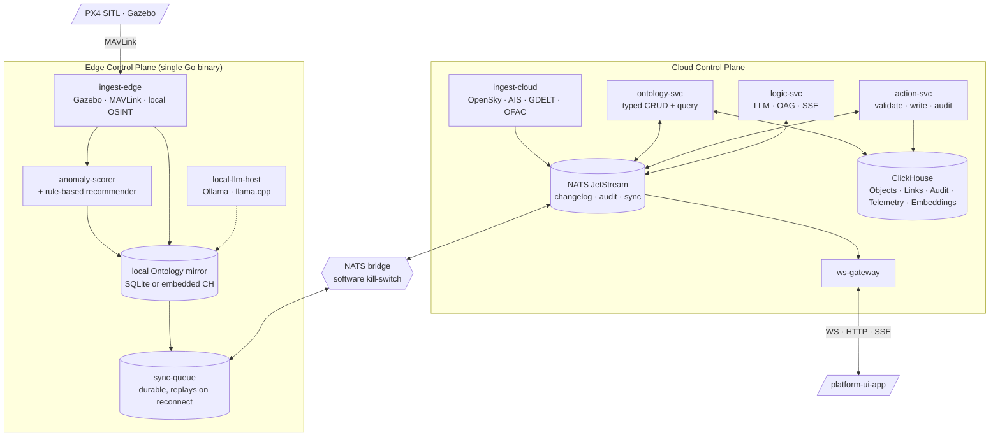
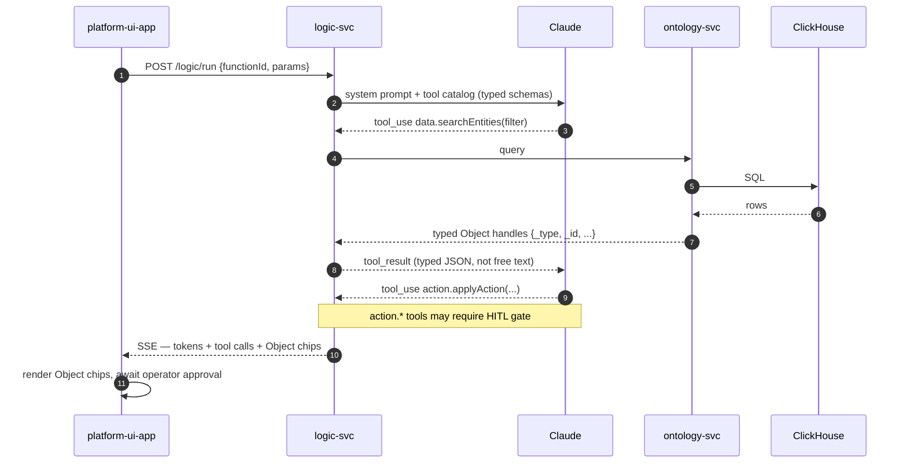
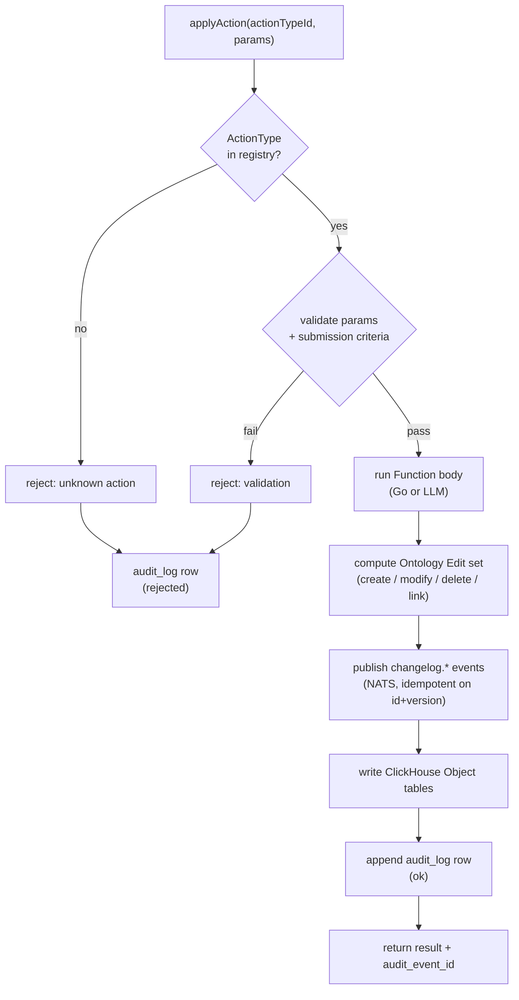

# ADR 0001 — Platform Control Plane Architecture

| Field        | Value                                                              |
| ------------ | ------------------------------------------------------------------ |
| Status       | Proposed                                                           |
| Date         | 2026-05-02                                                         |
| Scope        | `platform-control-plane/` — Go services and data plane only        |
| Out of scope | `platform-ui-app/` (separate ADR), drone simulation (separate ADR) |

---

## 1. Context

We are building an edge-native AI mission commander for a 48-hour Palantir-led
defense hackathon. The system fuses heterogeneous tactical data into a single
operational picture, narrates what changed, recommends explainable next actions,
and dispatches assets — with a human commander in the loop and the property of
continuing to function when severed from the cloud.

This ADR defines the architecture of the **control plane** — the Go services
and data plane that sit between raw data sources and the operator-facing app.
The control plane is the system's "AIP layer": it owns the typed Ontology,
mediates LLM reasoning, executes Actions, and propagates state changes.

The user-facing app and the asset-side simulation are separate concerns and are
addressed by sibling ADRs.

### Reference model

We are not building inside Palantir Foundry. We are building a **standalone
clone** that reads as Foundry/AIP-shaped to anyone familiar with those
products. The credibility win is mirroring a small set of AIP primitives and
their vocabulary precisely; everything else can be lean.

The single most load-bearing pattern we adopt from AIP is
**Ontology-Augmented Generation (OAG)**: LLM tools return typed Object handles
rather than free text, and every claim in an LLM response carries a reference
back to a real Object in the Ontology. This is the difference between "an AI
chatbot over our data" and "AIP."

---

## 2. Goals and non-goals

### Goals

- Provide a typed Ontology with first-class `ObjectType`, `PropertyType`,
  `LinkType`, `ActionType`, `FunctionType` primitives.
- Stream live data from heterogeneous sources into typed Ontology Objects with
  sub-second end-to-end latency.
- Emit a continuous, structured changelog ("What Changed") that downstream
  consumers (the UI, automations, the LLM) can subscribe to.
- Mediate LLM reasoning through a Logic engine that grounds every call in
  typed Ontology data using the OAG pattern.
- Execute write-back through a single Action lifecycle with submission
  criteria validation and an append-only audit log.
- Continue functioning at the edge when severed from cloud connectivity, with
  graceful sync on restore.

### Non-goals (for the hackathon scope)

- Multi-tenant isolation, role-based access control, classification markings.
- Branching, merge, and lineage of Ontology state.
- Generated client SDKs for multiple languages — one TypeScript shape is enough.
- Object Storage V2 / search index parity — we use ClickHouse as both store and index.
- Eval suites and observability dashboards beyond a structured log.
- Horizontal scale-out — single-node ClickHouse, single-node NATS.

---

## 3. Architectural decisions (summary)

| #     | Decision                                                                         |
| ----- | -------------------------------------------------------------------------------- |
| D-001 | Three logical tiers: Cloud Control Plane, Edge Control Plane, Asset Layer        |
| D-002 | Standalone AIP-shaped clone; we reference Foundry conceptually only              |
| D-003 | Go for all control-plane services, on both cloud and edge                        |
| D-004 | ClickHouse as the canonical store for Objects, Links, Audit, Telemetry           |
| D-005 | NATS JetStream as the changelog bus and edge↔cloud sync transport                |
| D-006 | Anthropic Claude (cloud) + local model via Ollama/llama.cpp (edge) for LLM       |
| D-007 | Ten AIP primitives cloned with mirrored vocabulary                               |
| D-008 | OAG: LLM tools return typed Object handles; UI renders chips                     |
| D-009 | Single Action lifecycle: validate → mutate → audit, atomic                       |
| D-010 | Comms denial via a software kill-switch at the edge↔cloud NATS link              |
| D-011 | Streaming-first: every ingest path emits a changelog event before persisting     |

Each is elaborated below.

---

## 4. Component model

### 4.1 Logical layers



### 4.2 Cloud control plane services

Each is a separate Go binary. All communicate over NATS for events and gRPC
for synchronous calls; the WebSocket gateway is the only HTTP/WS edge.

#### `ontology-svc`

Owns the typed Ontology. Provides:

- A registry of `ObjectType`, `PropertyType`, `LinkType`, `ActionType`,
  `FunctionType` definitions, loaded at boot from Go code (the "spec").
- A typed query API (gRPC + HTTP/JSON) that mirrors OSDK ergonomics:
  `Get(id)`, `Where(filter)`, `Linked(id, linkType)`, `Page(...)`.
- A bulk upsert path for ingestors. Upserts produce changelog events and
  ClickHouse writes atomically (see §5).

The ontology spec is **code-defined**, not config-defined. We get static
typing, refactor safety, and the LLM tool catalog generates from the same Go
source.

#### `action-svc`

Owns the write-back path. The only way to mutate Ontology state.

- Loads `ActionType` definitions from the ontology spec.
- For each `applyAction(actionTypeId, params)` request: validates params
  against the type's submission criteria, runs the Action's Function (which
  may invoke other Functions or external systems), produces an Ontology Edit
  (create / modify / delete / link), persists to ClickHouse, appends to
  `audit_log`, and emits a changelog event. Atomic at the request level.
- Surfaces an HTTP endpoint `POST /actions/{actionTypeId}` and a gRPC
  equivalent for service-to-service calls (the LLM orchestrator uses gRPC).

#### `logic-svc`

The AIP Logic equivalent — the LLM orchestrator.

- Loads `FunctionType` definitions; each Function has either a
  Go-implemented body or an LLM-backed body. LLM-backed Functions carry a
  `{systemPrompt, tools[]}` definition (YAML for now, code-loaded at boot).
- Runs the tool-use loop against Anthropic Claude (Sonnet 4.6 or Opus 4.7)
  using the official Go SDK. Tools fall into three categories with explicit
  prefixes:
  - `data.*` — Ontology queries (delegated to `ontology-svc`)
  - `logic.*` — call another Function (recursive composition)
  - `action.*` — invoke an Action via `action-svc` (with optional
    human-in-the-loop gating)
- Streams responses to clients via SSE; the response stream interleaves
  partial assistant tokens, tool-call events with typed Object handles, and
  Action submissions.
- This is where OAG lives. See §6.

#### Ingestors (`ingest-cloud-*`)

One small Go binary per source family. Each reads its source, normalizes
records into Ontology Objects, and produces changelog events that are
consumed by `ontology-svc`. Initial sources:

- `ingest-opensky` — live ADS-B → `Aircraft` Objects
- `ingest-ais-replay` — replayed AIS at 60× → `Vessel` Objects
- `ingest-gdelt` — live OSINT events → `Event` Objects
- `ingest-reports-csv` — pre-authored radio reports → `Report` Objects
- `ingest-units-script` — scripted friendly forces → `Unit` Objects

Adding a source is "write a new tiny binary that emits to NATS." This shape
is intentional: the demo's "fusion" beat depends on us being able to add
sources cheaply.

#### `ws-gateway`

The single point of contact for the user-facing app. Accepts WebSocket
connections, subscribes per-client to relevant NATS subjects (filtered by
Object Type, geo, mission, etc.), and fans out:

- Changelog events for live Object updates.
- Audit events for the live audit ticker.
- SSE streams from `logic-svc` proxied through to chat clients.

### 4.3 Edge control plane

`edge-node` is a single Go binary deployed on the laptop that doubles as the
"tactical edge node." It contains scaled-down versions of `ingest-*`,
`ontology-svc`, `action-svc`, and `logic-svc`, plus:

- A **local Ontology mirror** in SQLite or embedded ClickHouse. Schema is
  identical in shape; volume is small enough for in-memory if needed.
- A **durable sync queue** (NATS JetStream client with local persistence)
  that captures every changelog event and Action while disconnected.
- A **kill-switch** on the upstream NATS bridge that simulates comms denial.
- A **local LLM host** (Ollama or llama.cpp serving Llama 3.3 8B / Qwen 2.5
  7B; final model TBD) that handles NL Q&A and simple tool-use when severed.

When connected, the edge node is mostly a write-through cache with some
local-first reasoning (rule-based recommender, anomaly scorer). When severed,
the edge node continues to ingest, score, recommend, and answer queries
locally; on reconnect, the sync queue cascades upstream and downstream
divergence is reconciled (last-write-wins on `(object_id, version)`).

---

## 5. Data plane

### 5.1 ClickHouse schema strategy

Each `ObjectType` maps to a `ReplacingMergeTree` table:

```sql
CREATE TABLE ontology.aircraft (
  id          String,
  version     UInt64,
  -- typed properties, one column each
  callsign    Nullable(String),
  position    Tuple(Float64, Float64),
  altitude_m  Nullable(Float64),
  ...
  observed_at DateTime64(3),
  ingested_at DateTime64(3)
) ENGINE = ReplacingMergeTree(version)
ORDER BY id;
```

- `ReplacingMergeTree(version)` keeps the latest version of each Object id
  after merge. Reads use `FINAL` or `argMax(version, ...)` to get current state.
- Each `LinkType` is a separate join table, also `ReplacingMergeTree`,
  ordered by `(from_id, to_id, link_type)`.
- The audit log is a single append-only `MergeTree`:

```sql
CREATE TABLE ontology.audit_log (
  event_id        UUID,
  occurred_at     DateTime64(3),
  actor           String,
  action_type     String,
  params          String,         -- JSON
  ontology_edits  String,         -- JSON
  result          Enum8('ok'=1, 'rejected'=2, 'error'=3),
  reason          Nullable(String)
) ENGINE = MergeTree()
ORDER BY (occurred_at, event_id);
```

- Telemetry (high-volume, time-series) lives in per-source `MergeTree` tables
  partitioned by hour.
- Embeddings for RAG over `Report` text use `Array(Float32)` columns with the
  ClickHouse HNSW vector index (≥ 24.x). Embedding provider is hosted (Voyage
  AI or OpenAI); no local Python dependency.

ClickHouse is the read store and the historical record. **It is not the
change bus.**

### 5.2 NATS JetStream as the change bus

ClickHouse has no pub/sub. We solve this by making the bus the source of
truth for *deltas* and ClickHouse the source of truth for *queries*.

The contract: every component that mutates Ontology state **publishes the
changelog event first, then writes to ClickHouse**. If the ClickHouse write
fails, the event is replayed from JetStream (idempotent on `(id, version)`).
If the publish fails, the operation is retried before any write happens.

Subject conventions:

```
changelog.<object_type>.<id>     # Object upsert / delete
audit.<action_type>              # Action result
sync.edge.<edge_id>.outbound     # Edge → Cloud
sync.edge.<edge_id>.inbound      # Cloud → Edge
logic.stream.<request_id>        # SSE streaming (cloud only)
```

### 5.3 Why ClickHouse + NATS, not a relational + outbox

- ClickHouse trivially handles the time-windowed "What Changed" query (last
  N minutes of changelog), the audit ticker (live tail of audit_log), and
  geo-filtered Object queries — all the read patterns the demo needs.
- NATS JetStream gives durable subjects, replay, and consumer groups out of
  the box. For 48 hours, this is far less ceremony than Postgres + Debezium.
- The two-step commit (publish, then persist) is acceptable because we are
  effectively a single-writer system per object id; there is no contention.

### 5.4 Embeddings and OAG

`Report` Objects (operator/radio reports) are embedded at ingest time with a
hosted embedding model. The `Report` table carries an `Array(Float32)`
embedding column with an HNSW index. The `data.searchReports(query)` tool
runs a vector search server-side and returns typed `Report` handles — never
raw chunks. This preserves OAG: the LLM never sees a free-text blob without
a corresponding Object reference.

---

## 6. Ontology-Augmented Generation (OAG)

### 6.1 The pattern

1. The user (or the UI on their behalf) calls a Function via `logic-svc`,
   passing typed Object handles (or none) as parameters.
2. `logic-svc` constructs a system prompt, attaches the Function's tool
   list, and invokes Claude with tool use enabled.
3. The LLM emits a tool call. `logic-svc` routes the call to its category:
   `data.*` → `ontology-svc`; `logic.*` → another Function;
   `action.*` → `action-svc` (with HITL gate).
4. Tool results are returned to the LLM as **typed JSON**, never as flat
   text:

   ```json
   {
     "tool": "data.searchEntities",
     "result": [
       {"_type": "Vessel", "_id": "MMSI-636019825", "name": "...", "lat": ..., ...},
       {"_type": "Vessel", "_id": "MMSI-211421510", "name": "...", "lat": ..., ...}
     ]
   }
   ```

5. The LLM continues, optionally calling more tools, and produces a final
   message that **must** carry Object id citations for every claim.
6. The frontend renders any `{_type, _id, ...}` shape as a clickable Object
   chip. This is the visible signature of OAG.



### 6.2 What we enforce in the prompt

- A system instruction that the model must cite an Object id for every
  factual claim, and may not invent ids.
- A tool catalog stamped with the Object Type schema so the model is
  grounded in what exists.
- A response schema that segregates "narration" from "object refs," so the
  UI can highlight one vs. the other.

### 6.3 Why this matters

OAG is the single primitive that distinguishes this clone from "a chatbot
over our data." Every part of the demo arc — the operator chatting, the
LLM proposing courses of action, the audit trail tying back to inputs —
collapses if Object handles aren't first-class. The control plane is built
around making sure they are.

---

## 7. Action lifecycle

Every mutation goes through one path:



**Submission criteria** are predicates on the params and on current Ontology
state. Examples: "drone has battery > 25%," "target is within ROE bounds,"
"operator has confirmed within last 30 seconds." These are typed Go
predicates living next to the ActionType definition.

**Human-in-the-loop gating.** Action types are tagged `auto | confirm |
forbid-llm`. `confirm` Actions, when invoked from `logic-svc`, return a
pending state and require a separate confirmation `applyAction` call from a
human. The audit log records both the proposal and the confirmation.

**Idempotency.** Every `applyAction` call carries a client-supplied
`request_id`; replays return the original result.

---

## 8. Comms-denial behavior

The kill-switch is a single boolean on the edge-node's NATS bridge to the
cloud. The edge node moves through three states:

```mermaid
stateDiagram-v2
    [*] --> Connected
    Connected --> Severed: kill-switch ON
    Severed --> Reconciling: kill-switch OFF
    Reconciling --> Connected: queues drained

    Connected: cloud LLM available; bidirectional Object flow
    Severed: local LLM only; edge ingest continues; Actions queue locally
    Reconciling: outbound + inbound replay; LWW on (id, version)
```



When flipped:

| Function                      | Behavior when severed                                |
| ----------------------------- | ---------------------------------------------------- |
| Edge ingest                   | Continues; writes to local mirror                    |
| Cloud-fed Object updates      | Stop; UI shows badge "Edge severed at HH:MM:SS"      |
| Action invocations from edge  | Validated and applied locally; queued for sync       |
| LLM Q&A from edge UI          | Routed to local-llm-host (degraded but functional)   |
| Plan generation (Opus-class)  | Unavailable; UI marks "Plan generation requires cloud"|
| Audit log                     | Appended locally, replayed on reconnect              |

On reconnect:

1. Outbound sync queue replays edge → cloud. Cloud applies events in version
   order; conflicts are resolved last-write-wins on `(object_id, version)`.
2. Inbound sync queue replays cloud → edge for everything missed.
3. The UI's "What Changed" panel shows the cascade visually — this is part
   of the demo arc.

**No multi-edge merge.** A single edge node simplifies version semantics. If
we ever add a second edge, the strategy would be a vector clock per Object
id; out of scope here.

---

## 9. External boundaries

The control plane exposes exactly three kinds of contracts:

1. **HTTP/JSON + WebSocket** to `platform-ui-app`, via `ws-gateway`. Schemas
   live in the `platform-control-plane/contracts/` package and are generated
   into TypeScript for the UI.
2. **MAVLink** to the asset layer (PX4 SITL / future hardware), via the
   `ingest-mavlink` ingestor. This is treated as just another stream source.
3. **HTTPS** outbound to data sources (OpenSky, GDELT, OFAC) and to the LLM
   provider (Anthropic). One thin client per source.

There is no public API. Everything in is "data source," everything out is
"the operator's app or the asset layer."

---

## 10. What we explicitly skip

- Branching, merge proposals, lineage of Ontology state.
- Mandatory access controls and classification markings (badge in UI only).
- Generated client codegen — we hand-write the typed Go API and a thin TS
  contract layer.
- Object Storage V2 — ClickHouse is the indexed store.
- Eval suites for the LLM (we keep one smoke fixture per Function).
- Horizontal scale-out of any service.
- Persistent identities and auth — single hardcoded operator for the demo.

---

## 11. Open questions (to resolve before build starts)

| #   | Question                                                                | Owner | Due  |
| --- | ----------------------------------------------------------------------- | ----- | ---- |
| Q-1 | Local LLM model: Llama 3.3 8B vs Qwen 2.5 7B vs MLX-optimized Phi-class | TBD   | T-0  |
| Q-2 | STT path for voice: faster-whisper local vs Deepgram/Whisper API        | TBD   | T-0  |
| Q-3 | Single-node ClickHouse via Docker or native install on demo laptop      | TBD   | T-0  |
| Q-4 | Edge mirror store: SQLite vs embedded ClickHouse                        | TBD   | T-0  |
| Q-5 | Final list of 9 Object Types and their Property fields                  | All   | T-0  |
| Q-6 | List of Action Types needed for the demo arc                            | All   | T-0  |
| Q-7 | List of LLM Functions and their tool catalogs                           | All   | T-0  |
| Q-8 | Gating policy: which Action Types are `auto` vs `confirm`               | All   | T-0  |

These are blocking for sub-ADRs 0002+ and the implementation.

---

## 12. Glossary

| Term                                  | Meaning                                                  |
| ------------------------------------- | -------------------------------------------------------- |
| Object Type                           | A typed entity class in the Ontology                     |
| Object handle                         | A `{_type, _id, ...}` reference returned by a tool       |
| Property Type                         | A typed field on an Object Type                          |
| Link Type                             | A typed relationship between Object Types                |
| Action Type                           | A typed write-back operation, the only mutation path     |
| Function Type                         | A typed callable; may be Go-backed or LLM-backed         |
| Submission criteria                   | Predicates that gate an Action invocation                |
| Tool                                  | A capability exposed to the LLM, in `data.*`/`logic.*`/`action.*` |
| OAG                                   | Ontology-Augmented Generation — LLM grounded on typed Objects |
| Course of Action (COA)                | An LLM-proposed plan represented as typed Objects        |
| What Changed                          | The rolling changelog feed the UI subscribes to          |
| Tactical edge                         | The edge control plane node (the laptop in our case)     |
| Comms denial                          | The kill-switch state — edge severed from cloud          |

---

## 13. Future ADRs

This document is the spine. Each item below will be elaborated in its own
ADR before or during implementation.

- **0002 — Ontology object specs.** Field-by-field definitions for the 9
  Object Types and their Link Types.
- **0003 — Action Types and submission criteria.** The full set of Actions
  the demo needs, with gating policy.
- **0004 — LLM Function catalog and tool taxonomy.** The exhaustive
  `data.*`/`logic.*`/`action.*` list, system prompts, and HITL gates.
- **0005 — ClickHouse schema and migration policy.** DDL, partition
  strategy, retention.
- **0006 — NATS subject taxonomy and durability policy.** Stream config,
  consumer groups, retention.
- **0007 — Edge sync protocol.** Conflict resolution, queue durability,
  reconnect cascade.
- **0008 — Local LLM hosting.** Model choice, prompt parity with cloud,
  fallback paths.

---

## 14. References

- AIP and Foundry primitives (Ontology, Logic, Threads, Workshop) are the
  conceptual reference. We do not depend on Foundry at runtime.
- "Reducing Hallucinations with the Ontology in Palantir AIP" — the
  canonical OAG framing.
- Anthropic Claude Go SDK — `github.com/anthropics/anthropic-sdk-go`.
- ClickHouse Go driver — `github.com/ClickHouse/clickhouse-go/v2`.
- NATS JetStream Go client — `github.com/nats-io/nats.go`.
