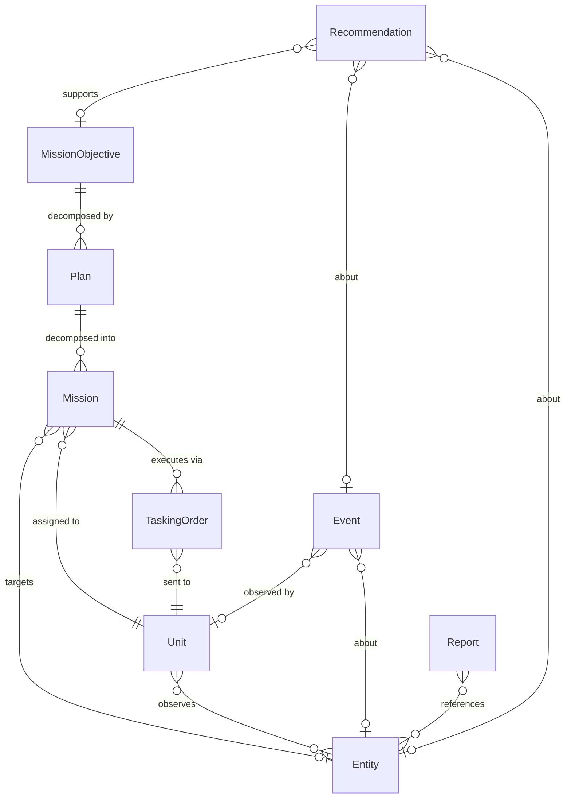

# ADR 0002 — Ontology Object Specs

| Field        | Value                                                           |
| ------------ | --------------------------------------------------------------- |
| Status       | Proposed                                                        |
| Date         | 2026-05-02                                                      |
| Scope        | Field-by-field shape of the 9 Object Types and their Link Types |
| Supersedes   | —                                                               |
| Superseded by| —                                                               |
| Refs         | [0001 — Platform Architecture](0001-platform-architecture.md)   |

---

## 1. Context

ADR 0001 established the control plane shape and named nine Object Types. This
ADR fixes the field-by-field schema for those types and the typed Link Types
between them. Subsequent ADRs (0003 Action Types, 0004 LLM Function catalog,
0005 ClickHouse migrations) build on this spec.

The schema is deliberately the smallest set that supports the demo arc end to
end. We expand types and links **only when a concrete demo step requires it**;
we do not predict-then-implement.

---

## 2. Decisions (summary)

| #     | Decision                                                                              |
| ----- | ------------------------------------------------------------------------------------- |
| O-001 | Nine Object Types: Entity, Event, Report, Unit, Recommendation, MissionObjective, Plan, Mission, TaskingOrder |
| O-002 | `Entity` is a single table with a `subtype` discriminator (Vessel/Aircraft/Vehicle/Person/Threat/Unknown), not per-subtype tables |
| O-003 | All Object ids are UUID v7 minted on first ingest. External natural keys go in `source` + `source_ref` for traceability |
| O-004 | Every Object carries the canonical envelope: `_id`, `_version`, `_observed_at`, `_ingested_at`, `_subtype` (where applicable) |
| O-005 | 1:M links materialize as a foreign-key column on the child; M:M links materialize as separate `link_*` tables |
| O-006 | Plan → Mission → TaskingOrder is a strict three-level hierarchy. No nesting, no cross-Plan Missions |
| O-007 | `Detection` is an `Event` with `kind = "detection"`. We do not introduce a separate Object Type |
| O-008 | Versions are `UInt64` nanoseconds derived from `_observed_at`. Reads use `argMax(_version, ...)` — most-recent-observation wins. No per-id sequence lookup |
| O-009 | Geo positions are `Tuple(Float64, Float64)` as `(lat, lon)`. Polygons are `Array(Tuple(Float64, Float64))`. No PostGIS-equivalent functions in v1 |
| O-010 | Embeddings live on `Report` only in v1; HNSW index, hosted embedding provider |

Each is elaborated below.

---

## 3. Type tree and cardinalities



Six "core" types describe the world (Entity, Event, Report, Unit,
Recommendation, MissionObjective). Three "execution" types describe how
intent is realized (Plan, Mission, TaskingOrder).

---

## 4. Common envelope

Envelope fields are split into **universal** (every Object Type carries
them) and **conditional** (only where applicable).

### 4.1 Universal envelope

| Field          | Type                       | Notes                                                          |
| -------------- | -------------------------- | -------------------------------------------------------------- |
| `_id`          | `String` (UUIDv7)          | Primary key. Minted on first ingest                            |
| `_version`     | `UInt64`                   | Nanoseconds. Equals `toUnixTimestamp64Nano(_observed_at)`. Most-recent-observation wins |
| `_observed_at` | `DateTime64(3)`            | Time the Object reflects state of the world                    |
| `_ingested_at` | `DateTime64(3)`            | Time the platform learned about it                             |
| `_source`      | `LowCardinality(String)`   | Producer. See §11 for the prefix scheme (`ingest:*`, `system:*`, `operator:*`) |

### 4.2 Conditional envelope

| Field         | Type                        | Applies to                          | Notes                                       |
| ------------- | --------------------------- | ----------------------------------- | ------------------------------------------- |
| `_subtype`    | `LowCardinality(String)`    | Entity, Event, Report, Unit         | Discriminator for variant types             |
| `_source_ref` | `Nullable(String)`          | Externally-sourced Objects only     | Natural key from source (MMSI, ICAO24). `NULL` for internally-minted Objects (Plan, Mission, Recommendation, MissionObjective, TaskingOrder) |

Reads always project the latest version per `_id`. The CH layer (§9) handles
this with `ReplacingMergeTree(_version) ORDER BY _id` plus `argMax(_version, ...)`
(preferred) or `FINAL` (ad-hoc only).

---

## 5. Object Type specs

### 5.1 `Entity`

Anything on the map. One table, discriminated by `_subtype`.

| Field           | Type                                  | Notes                                                  |
| --------------- | ------------------------------------- | ------------------------------------------------------ |
| `_subtype`      | `LowCardinality(String)`              | one of `Vessel`, `Aircraft`, `Vehicle`, `Person`, `Threat`, `Unknown` |
| `name`          | `Nullable(String)`                    | display name (callsign, vessel name, ...)              |
| `position`      | `Tuple(Float64, Float64)`             | `(lat, lon)` — see §11                                 |
| `altitude_m`    | `Nullable(Float64)`                   | Aircraft only                                          |
| `heading_deg`   | `Nullable(Float64)`                   | 0–360                                                  |
| `speed_mps`     | `Nullable(Float64)`                   | meters/sec                                             |
| `course_deg`    | `Nullable(Float64)`                   | over-ground                                            |
| `confidence`    | `Float32`                             | 0–1, source-supplied or rule-derived                   |
| `threat_level`  | `LowCardinality(String)`              | one of `none`, `low`, `med`, `high`; derived; default `none` |
| `attributes`    | `Map(LowCardinality(String), String)` | sparse subtype-specific (mmsi, icao24, signing_id)     |

Notes:
- **No subclassing in code.** Go consumers branch on `_subtype` if needed; LLM tools see one shape.
- **No PostGIS.** Geo filters use bounding-box predicates over `position.1`, `position.2`. Distance computed in Go where needed.
- **`Threat` subtype vs `threat_level`.** They are independent. `_subtype = "Threat"` means we have classified *what kind of thing it is* as hostile; `threat_level` is a current assessment intensity that any subtype can carry. A friendly `Vehicle` with `threat_level = "none"` is normal; a `Threat` with `threat_level = "high"` is the prioritized case.

### 5.2 `Event`

A discrete occurrence. Detections, deviations, RF pings, AIS gaps, anomalies.

| Field           | Type                                              | Notes                                  |
| --------------- | ------------------------------------------------- | -------------------------------------- |
| `_subtype`      | `LowCardinality(String)`                          | one of `detection`, `deviation`, `rf_ping`, `ais_gap`, `anomaly`, `report_link` |
| `entity_id`     | `Nullable(String)`                                | FK → Entity                            |
| `unit_id`       | `Nullable(String)`                                | FK → Unit (the sensor)                 |
| `position`      | `Nullable(Tuple(Float64, Float64))`               | optional; `(lat, lon)`                 |
| `severity`      | `LowCardinality(String)`                          | one of `info`, `warn`, `critical`; default `info` |
| `description`   | `String`                                          | one-line human-readable                |
| `payload`       | `String` (JSON)                                   | subtype-specific structured data       |

Notes:
- **`Detection` is `_subtype = "detection"`.** No separate type. (O-007.)
- **`payload`** is JSON because the subtype variability is high and we don't want a wide nullable wall.
- **One event per occurrence.** A vessel deviating from its track produces one `Event(deviation)`, not one per timestep.

### 5.3 `Report`

A textual report — operator narrative, radio chatter, intel report, OSINT clip.

| Field             | Type                          | Notes                                            |
| ----------------- | ----------------------------- | ------------------------------------------------ |
| `_subtype`        | `LowCardinality(String)`      | one of `operator`, `radio`, `sigint`, `osint`, `unknown` |
| `author`          | `Nullable(String)`            | call sign, channel, or station                   |
| `channel`         | `Nullable(String)`            | radio frequency, slack channel, etc.             |
| `text`            | `String`                      | the report body                                  |
| `text_embedding`  | `Array(Float32)` (length 1024)| Voyage `voyage-3`; HNSW indexed (`dim=1024`)     |
| `entity_refs`     | `Array(String)`               | extracted Entity ids (NER on ingest, optional)   |
| `classification`  | `LowCardinality(String)`      | one of `unclass`, `cui`, `confidential`; display badge |

Notes:
- **Embeddings live here, nowhere else in v1.** Other Objects don't need RAG.
- **`entity_refs` is best-effort.** The OAG flow searches by embedding *and* by mentioned ids, then the LLM resolves.

### 5.4 `Unit`

A friendly asset under our control or coordination. Drones, vehicles,
infantry, boats, command posts.

| Field                | Type                                  | Notes                              |
| -------------------- | ------------------------------------- | ---------------------------------- |
| `_subtype`           | `LowCardinality(String)`              | one of `drone`, `vehicle`, `infantry`, `boat`, `command_post` |
| `callsign`           | `String`                              | unique within scope                |
| `position`           | `Tuple(Float64, Float64)`             | `(lat, lon)`                       |
| `altitude_m`         | `Nullable(Float64)`                   | airborne units                     |
| `heading_deg`        | `Nullable(Float64)`                   |                                    |
| `speed_mps`          | `Nullable(Float64)`                   |                                    |
| `status`             | `LowCardinality(String)`              | one of `idle`, `en_route`, `on_station`, `returning`, `offline` |
| `battery_pct`        | `Nullable(Float32)`                   | 0–100                              |
| `fuel_pct`           | `Nullable(Float32)`                   | 0–100                              |
| `capabilities`       | `Array(LowCardinality(String))`       | `optical`, `ir`, `sigint`, `eo`, `kinetic` |

Notes:
- **`position` is the latest known.** Telemetry historicals live in a side table, not here.
- **`status`** is the workflow flag. ROE / submission-criteria predicates use this.
- **MAVLink-agnostic.** Sim units and real hardware look identical at this level.
- **No `assigned_mission_id`.** The active Mission for a Unit is computed on read: `Mission WHERE assigned_unit_id = X AND status IN ('queued', 'en_route', 'executing') ORDER BY _version DESC LIMIT 1`. Mission is the single source of truth; denormalizing onto Unit creates a cross-table consistency hole that CH cannot guard.

### 5.5 `Recommendation`

An AI-generated proposal. Always cites Objects.

| Field                  | Type                                  | Notes                                             |
| ---------------------- | ------------------------------------- | ------------------------------------------------- |
| `subject_entity_id`    | `Nullable(String)`                    | FK → Entity (the thing the rec is about)          |
| `subject_event_id`     | `Nullable(String)`                    | FK → Event                                        |
| `objective_id`         | `Nullable(String)`                    | FK → MissionObjective (if rec supports one)       |
| `proposed_action_type` | `LowCardinality(String)`              | name of an ActionType (defined in ADR 0003)       |
| `proposed_params`      | `String` (JSON)                       | parameters for `applyAction`                      |
| `rationale`            | `String`                              | natural language; the "because"                   |
| `confidence`           | `Float32`                             | 0–1                                               |
| `evidence_refs`        | `Array(String)`                       | Object ids the rec cites                          |
| `status`               | `LowCardinality(String)`              | one of `pending`, `accepted`, `rejected`, `expired`; default `pending` |
| `decided_by`           | `Nullable(String)`                    | actor — see §11                                   |
| `decided_at`           | `Nullable(DateTime64(3))`             |                                                   |

Notes:
- **`evidence_refs` is mandatory in spirit.** A rec with empty evidence is a hallucination smell; the validator should warn.
- **Acceptance is an Action** (`acceptRecommendation`), defined in ADR 0003. This Object only records the outcome.

### 5.6 `MissionObjective`

What the commander cares about right now. The "intent" layer.

| Field                | Type                                  | Notes                                          |
| -------------------- | ------------------------------------- | ---------------------------------------------- |
| `title`              | `String`                              | short                                          |
| `description`        | `String`                              | long-form intent                               |
| `priority`           | `LowCardinality(String)`              | one of `P0`, `P1`, `P2`                        |
| `target_entity_id`   | `Nullable(String)`                    | FK → Entity (if specific)                      |
| `target_area`        | `Nullable(Array(Tuple(Float64, Float64)))` | polygon — see §11 for closure / winding   |
| `deadline`           | `Nullable(DateTime64(3))`             |                                                |
| `status`             | `LowCardinality(String)`              | one of `open`, `active`, `completed`, `cancelled`; default `open` |

Notes:
- **Authored by the operator**, sometimes generated by an LLM Function from a Report.
- **One Objective can spawn multiple Plans** (different COAs against the same target).

### 5.7 `Plan`

Commander-level intent realized as a coordinated sequence of Missions. The
output of "give me three options" is three `Plan` Objects, each with its own
`Mission` set.

| Field             | Type                                  | Notes                                          |
| ----------------- | ------------------------------------- | ---------------------------------------------- |
| `objective_id`    | `Nullable(String)`                    | FK → MissionObjective                          |
| `title`           | `String`                              | LLM-generated short title                      |
| `summary`         | `String`                              | LLM-generated 1–3 sentence rationale           |
| `status`          | `LowCardinality(String)`              | one of `draft`, `approved`, `executing`, `completed`, `aborted`, `superseded`; default `draft` |
| `confidence`      | `Float32`                             | LLM-self-reported, 0–1                         |
| `evidence_refs`   | `Array(String)`                       | Object ids the plan rests on                   |
| `approved_by`     | `Nullable(String)`                    | actor — see §11                                |
| `approved_at`     | `Nullable(DateTime64(3))`             |                                                |

Notes:
- **`Plan` does not own its child `Mission` ids.** The Mission carries `plan_id`. This avoids list mutation on Plan when Missions are added.
- **Approval is an Action** (`approvePlan`), defined in ADR 0003.
- **Auto-supersession.** When `approvePlan` fires for one Plan, all sibling Plans (same `objective_id`) in `draft` status are transitioned to `superseded` atomically as part of the same Action. This keeps the "three options, picked one" demo arc clean.
- **v1 keeps Plan thin.** ROE checks, resource allocation, and conflict detection between Plans are out of scope until a demo step demands them.

### 5.8 `Mission`

What one specific Unit does. The asset-level realization of a Plan.

| Field                | Type                                  | Notes                                          |
| -------------------- | ------------------------------------- | ---------------------------------------------- |
| `plan_id`            | `String`                              | FK → Plan (required)                           |
| `assigned_unit_id`   | `String`                              | FK → Unit (required)                           |
| `target_entity_id`   | `Nullable(String)`                    | FK → Entity                                    |
| `intent`             | `String`                              | "surveil from 5km altitude until 14:00"        |
| `waypoints`          | `Array(Tuple(Float64, Float64))`      | planned route; `(lat, lon)` per point          |
| `status`             | `LowCardinality(String)`              | one of `queued`, `en_route`, `executing`, `completed`, `failed`, `aborted`; default `queued` |
| `started_at`         | `Nullable(DateTime64(3))`             |                                                |
| `completed_at`       | `Nullable(DateTime64(3))`             |                                                |

Notes:
- **One Mission, one Unit.** A multi-asset coordination pattern is a Plan with N Missions.
- **`waypoints` is the planned route.** Actual telemetry lives in `Event(detection)` and `unit.position`.

### 5.9 `TaskingOrder`

The atomic command sent to a Unit. The MAVLink-shaped leaf of execution.

| Field                | Type                                  | Notes                                          |
| -------------------- | ------------------------------------- | ---------------------------------------------- |
| `mission_id`         | `String`                              | FK → Mission (required)                        |
| `unit_id`            | `String`                              | FK → Unit (required)                           |
| `command_type`       | `LowCardinality(String)`              | one of `goto`, `hover`, `return_to_base`, `observe`, `loiter`, `abort` |
| `params`             | `String` (JSON)                       | command-specific (e.g., `{"lat":..,"lon":..,"alt":..}`) |
| `status`             | `LowCardinality(String)`              | one of `pending`, `sent`, `acknowledged`, `executing`, `completed`, `failed`; default `pending` |
| `issued_by`          | `String`                              | actor — see §11                                |
| `issued_at`          | `DateTime64(3)`                       |                                                |
| `acknowledged_at`    | `Nullable(DateTime64(3))`             |                                                |
| `result`             | `Nullable(String)` (JSON)             | observation/outcome                            |

Notes:
- **Direct mapping to MAVLink commands.** `command_type` names mirror MAV_CMD families (loosely) so the bridge can dispatch without translation tables.
- **No nesting.** A multi-step routine is multiple TaskingOrders.
- **Status closure.** Transitions `pending → sent → acknowledged → executing → completed | failed` fire on inbound MAVLink ack/event from the asset (translated by the MAVLink bridge into Ontology Edits via the Action layer). A watchdog flips a stuck `sent`/`executing` order to `failed` after a configurable timeout (default 600s) with `result.reason = "timeout"`.

---

## 6. Link Types

| Link | From → To | Cardinality | Storage | Notes |
| ---- | --------- | ----------- | ------- | ----- |
| `entity_observed_by_unit` | Entity ↔ Unit | M:M | `link_entity_observed_by_unit` table | with `_first_seen_at`, `_last_seen_at`, `_observation_count` |
| `event_about_entity` | Event → Entity | M:1 | FK column on Event | `entity_id` |
| `event_observed_by_unit` | Event → Unit | M:1 | FK column on Event | `unit_id` |
| `report_references_entity` | Report ↔ Entity | M:M | `link_report_references_entity` table | `_confidence` per link |
| `recommendation_about_entity` | Recommendation → Entity | M:1 | FK column | `subject_entity_id` |
| `recommendation_about_event` | Recommendation → Event | M:1 | FK column | `subject_event_id` |
| `recommendation_supports_objective` | Recommendation → MissionObjective | M:1 | FK column | `objective_id` |
| `plan_for_objective` | Plan → MissionObjective | M:1 | FK column | `objective_id` |
| `mission_belongs_to_plan` | Mission → Plan | M:1 | FK column | `plan_id` |
| `mission_assigned_to_unit` | Mission → Unit | M:1 | FK column | `assigned_unit_id` |
| `mission_targets_entity` | Mission → Entity | M:1 | FK column | `target_entity_id` |
| `taskingorder_belongs_to_mission` | TaskingOrder → Mission | M:1 | FK column | `mission_id` |
| `taskingorder_to_unit` | TaskingOrder → Unit | M:1 | FK column | `unit_id` |

A Unit's active Mission is **derived on read** (see §5.4 Notes), not stored.

Each M:M link table is keyed on the natural pair `(_from_id, _to_id)`. No
synthetic `_id` column.

```sql
CREATE TABLE link_entity_observed_by_unit (
  _from_id           String,            -- Entity._id
  _to_id             String,            -- Unit._id
  _version           UInt64,            -- nanos; latest observation wins
  _first_seen_at     DateTime64(3),
  _last_seen_at      DateTime64(3),
  _observation_count UInt64,
  _ingested_at       DateTime64(3)
) ENGINE = ReplacingMergeTree(_version)
ORDER BY (_from_id, _to_id);
```

---

## 7. Identifier strategy

- **All Object ids are UUIDv7.** Stamped at first ingest, immutable.
- **External natural keys go in `_source_ref`.** The ingester's lookup-or-create path keys off `(_source, _source_ref)` and reuses the existing `_id`. This is the **only** dedup point.
- **Object ids are *opaque* across services.** Nothing parses them. Joins use them; humans don't read them.
- **Display names** come from `name` / `callsign` / `title`, never from `_id`.

Why UUIDv7 and not UUIDv4: UUIDv7 is time-ordered, which makes ClickHouse
range scans on `_id` cheap when we don't want to scan by time.

---

## 8. Versioning and writes

- `_version` is `UInt64`, **derived from `_observed_at`** as nanoseconds since epoch: `_version = toUnixTimestamp64Nano(_observed_at)`.
- This makes "most-recent-observation wins" the natural read semantic. `argMax(_version, ...)` and `argMax(_observed_at, ...)` produce identical results.
- No per-id sequence lookup. Writers do not `SELECT max(_version)` — they compute version locally from the observation timestamp. This is the property that lets streaming ingest scale.
- Two observations of the same `_id` with the same nanosecond `_observed_at` are treated as one (whichever lands first wins; the second is dropped on merge as a duplicate). Acceptable: at nanosecond resolution, this is an essentially-zero-probability collision for real-world feeds.
- **Late-arriving data is handled correctly.** A frame with `_observed_at` older than the current latest version is correctly ordered by `argMax`; the older frame does not overwrite the newer one.
- Reads use `argMax(_version, col)` patterns. `FINAL` is allowed for ad-hoc queries only — not on the hot path.
- **Implementation note: latest-version cache.** The writer keeps an in-memory LRU map of `(_object_type, _id) → latest _version` to skip "is this older than what we've already seen?" CH lookups during the lookup-or-create path. Cache is best-effort; correctness comes from `argMax` on read.
- Concurrent writers to the same `_id` are now safe: each writes its own `_version` derived from its own observation timestamp; latest wins on merge. Single-writer-per-Object-Type is no longer a correctness requirement (still recommended for simplicity).

---

## 9. ClickHouse storage strategy

### 9.1 Tables and engines

- One `ReplacingMergeTree(_version)` table per Object Type, ordered by `_id`.
- One link table per M:M Link Type, same engine, ordered by `(_from_id, _to_id)`.
- An append-only `MergeTree` `audit_log` (defined in ADR 0003).
- A high-volume `MergeTree` `telemetry` table (raw position pings) partitioned by hour, for time-series fan-out separate from current-state Object tables.
- HNSW vector index on `report.text_embedding` (CH ≥ 24.x), `dim=1024`.
- The actual DDL (CREATE TABLE) is in ADR 0005.

### 9.2 Data-skipping indexes (mandatory)

`ORDER BY _id` does not help filtered scans by geo, time, or subtype. Every
Object Type table carries the following CH skip indexes:

```sql
INDEX idx_pos        position       TYPE minmax       GRANULARITY 4,
INDEX idx_observed   _observed_at   TYPE minmax       GRANULARITY 4,
INDEX idx_subtype    _subtype       TYPE set(64)      GRANULARITY 4
```

Tables without `position` or `_subtype` (e.g., `audit_log`) skip the
corresponding index. The link tables additionally carry:

```sql
INDEX idx_from   _from_id   TYPE bloom_filter   GRANULARITY 4,
INDEX idx_to     _to_id     TYPE bloom_filter   GRANULARITY 4
```

These indexes are cheap to write and turn the "Entities in this bbox in the
last 5 min" demo query from a full scan into a partition-skipping scan.

### 9.3 Enum representation

All `_subtype`, `status`, `severity`, `kind`, `priority`, `classification`,
`threat_level`, `command_type` columns are `LowCardinality(String)`. **Not**
ClickHouse `Enum8`. Same compression, no migration ceremony when we add a
value. Validation is enforced Go-side (§10).

---

## 10. Validation and invariants

The ontology service enforces (Go-side):

| # | Invariant |
| - | --------- |
| V-1 | Every Object has a non-empty `_id` and `_observed_at` |
| V-2 | `_version` is strictly greater than the previous version for the same `_id` |
| V-3 | `_subtype` matches the type's enum |
| V-4 | FK columns reference an existing Object (or Nullable + null) |
| V-5 | Geo positions are within (-90..90, -180..180) |
| V-6 | `confidence` ∈ [0, 1] |
| V-7 | Enum statuses transition along whitelisted state machines (no `completed` → `pending`) |
| V-8 | `Recommendation` and `Plan` carry at least one `evidence_refs` entry |
| V-9 | `Recommendation` has at least one of (`subject_entity_id`, `subject_event_id`, `objective_id`) non-null |

V-4 is **not** referential integrity in the SQL sense; it's a write-time
check. CH does not enforce FKs.

---

## 11. Naming and AIP vocabulary

### 11.1 Type and field naming

- Object Type names are PascalCase singular: `Entity`, `Mission`. ClickHouse table names are snake_case singular: `entity`, `mission`.
- Property names are snake_case in CH and in JSON. Go structs use Go casing (`MissionID`, `AssignedUnitID`).
- Link Types are snake_case verbs: `mission_assigned_to_unit`, `report_references_entity`. Canonically directional (verb form).
- The LLM and the UI see Object handles as `{_type, _id, ...properties}` where `_type` matches the Object Type name (e.g., `"Mission"`, not `"mission"`).

This is the AIP-recognizable shape. Don't deviate.

### 11.2 Geo conventions (locked)

- **Coordinate order is `(lat, lon)` always.** `Tuple.1 = lat`, `Tuple.2 = lon`. This contradicts the GeoJSON `[lon, lat]` convention; the platform never uses GeoJSON ordering internally. Translate at the I/O boundary if needed.
- **Polygons are closed rings.** The first point equals the last point. Closure is enforced at write time (V- to be added if needed); rendering code may rely on it.
- **Polygon winding is CCW for interior**, CW for holes. v1 has no holes; this is a forward-compatibility note.
- **No self-intersection.** Validator rejects.
- **Bounding-box predicates do not work across the antimeridian** (e.g., a bbox spanning longitude 170°E to 170°W). This case is out of v1 scope; queries that try will return wrong results silently. Document and avoid.
- Distances and bearings are computed in Go using haversine; no CH function is used.

### 11.3 Actor naming (locked)

Wherever a field carries an actor identity (`decided_by`, `approved_by`,
`issued_by`, `audit_log.actor`, `_source` for non-ingest cases), the value
follows a prefix scheme:

| Prefix       | Meaning                                  | Example                       |
| ------------ | ---------------------------------------- | ----------------------------- |
| `operator:`  | Human operator                           | `operator:cmd-smith`          |
| `system:`    | Automated platform service               | `system:logic-svc`, `system:rule-recommender`, `system:watchdog` |
| `ingest:`    | External data source pipeline            | `ingest:opensky`, `ingest:ais-replay`, `ingest:gazebo` |
| `agent:`     | (Reserved for autonomous edge agents)    | `agent:edge-1`                |

The prefix is parseable; downstream consumers (audit dashboards, filters) split on `:` to group.

---

## 12. What we explicitly skip in v1

- **PostGIS-equivalent functions** (turf, h3, S2). Bounding-box predicates only.
- **Geometry types beyond Point and Polygon.** No multipolygons, no lines.
- **Per-subtype Entity tables.** One wide table; subtype is a column.
- **Soft delete or tombstoning.** Deletes are a `_subtype = "deleted"` Action edit, audit-logged.
- **Branching/proposals on Plans.** A new Plan is a new Object; supersession is via FK reference.
- **Multi-Plan conflict detection** (two Plans tasking the same Unit). Detected at write time only as a warning.
- **Time-travel queries** ("Ontology as of T"). v1 always reads latest version.

---

## 13. Open questions

| #   | Question                                                                | Owner | Notes |
| --- | ----------------------------------------------------------------------- | ----- | ----- |
| Q-1 | Telemetry retention: keep all raw position pings, or sample-and-decay?  | TBD   | Affects disk on demo machine |
| Q-2 | Do we model `Sensor` as a separate Object Type or stay with `Unit.capabilities`? | TBD | v1 stays with `capabilities`; revisit if a sensor lifecycle emerges |
| Q-3 | Should `Threat` be a separate Object Type, not just an `Entity._subtype`? | TBD | v1 stays as subtype; keep simple |
| Q-4 | Do we need a `Zone` / `Geofence` Object for ROE checks?                 | TBD   | Out of v1; add if Action submission criteria need it |
| Q-5 | Will Plan/Mission ever need many-to-many to allow multi-objective Plans? | TBD  | Not in v1 |
| Q-6 | `MissionObjective.target_area` is a single un-tagged polygon. If we accumulate exclusion zones, no-fly zones, etc., does it become a `Zone[]` reference? | TBD | See Q-4 |
| Q-7 | Telemetry timestamp resolution: do high-rate streams (drone @50Hz) need `DateTime64(6)` (microseconds) instead of `(3)` (milliseconds)? | TBD | v1 stays at ms; revisit when `telemetry` table is added |

---

## 14. What this ADR unblocks

- **ADR 0003 — Action Types and submission criteria.** Action shapes reference these Objects directly.
- **ADR 0004 — LLM Function catalog.** Tool signatures use these Objects as typed parameters and returns.
- **ADR 0005 — ClickHouse migrations.** Direct DDL fall-out from §5–§9.
- **`internal/ontology/`** package implementation: Go structs mirroring §5, registry implementing §10 invariants, typed CRUD over the CH layer.

---

## 15. Glossary additions

| Term | Meaning |
| ---- | ------- |
| Canonical envelope | The seven `_*` fields every Object carries (§4) |
| Subtype discriminator | The `_subtype` column that distinguishes variants within a single Object Type table (Entity, Event, Report, Unit) |
| Lookup-or-create | The ingester pattern that maps `(_source, _source_ref)` to a stable `_id`; the only dedup point |
| Evidence refs | Object ids that a Recommendation or Plan cites; required for OAG credibility |
