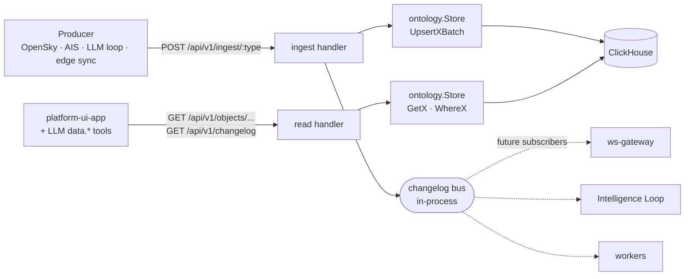

# ADR 0003 — HTTP API Layer (Ingest + Read)

| Field | Value |
| ----- | ----- |
| Status | Accepted |
| Date | 2026-05-02 |
| Scope | The HTTP write surface (ingest) and the HTTP read surface (UI + LLM tools), as one cohesive layer |
| Refs | [0001 Platform Architecture](0001-platform-architecture.md), [0002 Ontology Object Specs](0002-ontology-object-specs.md) |

---

## 1. Context

Producers (OpenSky scraper, AIS replayer, MAVLink bridge, the LLM
Intelligence Loop, edge sync) need a typed write boundary into the
Ontology. The UI and the LLM `data.*` tools need a typed read surface to
fetch the same Objects back. Both halves share the same `ontology.Store`
and the same JSON Object-handle shape, so they belong in one ADR.

This is the only HTTP surface in v1: ingest (writes) and reads (queries).
Actions, the Intelligence Loop, WebSocket fan-out, and bus subscribers all
sit *behind* this layer in later ADRs.

---

## 2. First principles

- **Ingest is a typed boundary.** Outside it, data is whatever shape the
  producer chose. Inside, every row obeys the canonical envelope and
  passes V-1..V-9. The boundary needs to be sharp because everything
  downstream — UI, LLM, audit, edge sync — assumes the data has already
  passed it.

- **Producers are dumb.** They POST JSON; they do not compute UUIDs, set
  `_ingested_at`, or know about ReplacingMergeTree. The server stamps
  what it owns.

- **Same SQL feeds reads and the LLM.** The UI's `GET /api/v1/objects/...`
  and the LLM's `data.searchEntities` both call the same store method. One
  source of truth for query shape; nobody drifts.

- **Object handles are uniform.** The JSON shape returned by reads —
  `{"_type": "Entity", "_id": "...", ...}` — is identical to what tools
  return to the LLM. UI and LLM see the same world.

- **LLM data.* tools bypass HTTP.** The `data.*` tool implementations
  call `ontology.Store` methods directly (in-process). The HTTP read
  endpoints exist for the UI and out-of-process callers; the SQL is the
  same. There is no localhost round-trip on the LLM hot path.

- **Dedup is automatic.** Deterministic `_id` from `(_source, _source_ref)`
  + ReplacingMergeTree. No lookup-or-create round-trip on the hot path.

---

## 3. Goals and non-goals

**Goals.** One typed write surface for every producer; one typed read
surface for UI and LLM. Sub-100ms median on a 100-row ingest batch.
Idempotent retries. Per-row pass/fail reporting on ingest. Keyset
pagination on reads.

**Non-goals (v1).** Auth, rate limiting, schema versioning,
streaming/NDJSON, gRPC, multi-tenant isolation, time-travel reads,
DELETE / PATCH on ingest (deletes and partial mutations go through
Actions in 0004; partial mutations don't compose with our
`_version`-newest-wins read model).

---

## 4. Decisions (summary)

### Ingest (write)

| #     | Decision                                                                                          |
| ----- | ------------------------------------------------------------------------------------------------- |
| I-001 | One `POST /api/v1/ingest/:type-plural` endpoint per Object Type. Nine routes total.               |
| I-002 | Body is a JSON array. Max 1000 rows / 10 MB.                                                      |
| I-003 | Server stamps `_id`, `_ingested_at`, `_version`. Producer-supplied `_ingested_at` and `_version` are silently overwritten. |
| I-004 | `_id` derivation: producer-supplied → use as-is; else `UUIDv5(ns, _source\|_source_ref)`; else fresh `UUIDv7`. |
| I-005 | Per-row validation. **Partial-success** batch: valid rows persist; invalid rows reported in response. HTTP 200. |
| I-006 | No auth in v1.                                                                                    |
| I-007 | After successful CH `Send`, ingest publishes one `ChangelogEvent` per accepted row to an in-process bus. Zero subscribers in v1; interface only. |

### Read

| #     | Decision                                                                                          |
| ----- | ------------------------------------------------------------------------------------------------- |
| R-001 | `GET /api/v1/objects/:type/:id` returns one Object. 404 on miss.                                  |
| R-002 | `GET /api/v1/objects/:type?<filters>` returns a page. Filters: `subtype`, `bbox`, `observed_after`, `observed_before`, `status`. |
| R-003 | Pagination is **keyset on `(_ingested_at, _id)`**. Opaque base64 cursor. `limit` default 100, max 1000. |
| R-004 | `GET /api/v1/objects/:type/:id/linked/:link-type` returns linked Objects (M:M link tables only).  |
| R-005 | `GET /api/v1/changelog?since=...&types=...` returns recent change rows. Backed by a CH SELECT, not the bus. |
| R-006 | `GET /api/v1/search?q=...&type=Report` does semantic search over `text_embedding`. v1: Report only. |
| R-007 | All reads use `argMax(_version, ...)` (preferred) or `FINAL` to project latest version per `_id`. |
| R-008 | Output JSON is the typed Object-handle shape — `{"_type", "_id", ...properties}`. Same shape the LLM tools see. |

---

## 5. Component model



The bus has zero subscribers in v1. It exists so future ADRs (WS gateway,
Intelligence Loop, workers) attach without ingest changing.

---

## 6. The HTTP surface

### 6.1 Ingest routes

| Route | Object Type |
| --- | --- |
| `POST /api/v1/ingest/entities` | Entity |
| `POST /api/v1/ingest/events` | Event |
| `POST /api/v1/ingest/reports` | Report |
| `POST /api/v1/ingest/units` | Unit |
| `POST /api/v1/ingest/recommendations` | Recommendation |
| `POST /api/v1/ingest/mission-objectives` | MissionObjective |
| `POST /api/v1/ingest/plans` | Plan |
| `POST /api/v1/ingest/missions` | Mission |
| `POST /api/v1/ingest/tasking-orders` | TaskingOrder |

### 6.2 Read routes

| Route | Purpose |
| --- | --- |
| `GET /api/v1/objects/:type/:id` | Single Object by id |
| `GET /api/v1/objects/:type` | Page of Objects with filters |
| `GET /api/v1/objects/:type/:id/linked/:link-type` | Linked Objects via an M:M link table |
| `GET /api/v1/changelog` | Recent change feed (`since`, `types`, `limit`) |
| `GET /api/v1/search` | Semantic search over Reports (`q`, `type`, `limit`) |

`:type` is the singular PascalCase Object Type name in routes that match
URL casing (`entity`, `event`, ...). The plural form (`entities`, ...) is
used only on ingest to emphasize the batch nature.

---

## 7. Ingest

### 7.1 Request body

```http
POST /api/v1/ingest/entities HTTP/1.1
Content-Type: application/json

[
  {
    "_subtype": "Aircraft",
    "_source": "ingest:opensky",
    "_source_ref": "A48119",
    "_observed_at": "2026-05-02T22:00:00Z",
    "name": "RCH-771",
    "lat": 51.4,
    "lon": -0.1,
    "altitude_m": 11000,
    "confidence": 0.95,
    "threat_level": "none",
    "attributes": {"icao24": "A48119", "callsign": "RCH-771"}
  }
]
```

### 7.2 Producer responsibilities

Required: `_observed_at` (RFC3339 with timezone), `_source` (must carry a
locked prefix — see §9), `_subtype` for discriminated types, plus the
type-specific fields per ADR 0002 §5.

Recommended: `_source_ref` — without it, every POST creates a fresh
UUIDv7 and dedup is impossible.

Server-stamped (producer values silently overwritten): `_id` (per I-004),
`_ingested_at`, `_version`.

### 7.3 Response

```json
{
  "accepted": 97,
  "rejected": 3,
  "errors": [
    { "index": 5,  "_source_ref": "BADKEY", "errors": ["_subtype \"Spaceship\" not allowed"] },
    { "index": 23, "_source_ref": null,     "errors": ["_observed_at is zero", "lat 99.5 out of [-90,90]"] },
    { "index": 88, "_source_ref": "A48119", "errors": ["confidence 1.7 out of [0,1]"] }
  ]
}
```

`HTTP 200` even when `rejected > 0`. Producers parse the body to learn
per-row outcomes. Whole-batch failures (parse error, body too large, CH
unavailable) return `4xx` / `5xx` with `{"error": "..."}`.

### 7.4 Stamping algorithm

For each row, in order:

```
1. JSON-unmarshal into the typed struct.
2. _id:
     if row._id != ""           → use as-is (UUID format checked)
     elif row._source_ref != "" → uuidv5(ontologyNS, row._source + "|" + row._source_ref)
     else                       → uuidv7()
3. _ingested_at := time.Now().UTC()
4. _version     := _observed_at.UnixNano()
5. ValidateX(row).  Failures collect; do not abort siblings.
```

`ontologyNS` is a single hardcoded UUID baked into the binary. Same value
forever — changing it would invalidate every existing `_id`.

### 7.5 Persistence

After validation:

- `accepted []*T` and `rejected []ErrorRow` live in memory.
- Single `store.UpsertXBatch(ctx, accepted)` call. One CH `PrepareBatch`,
  N `Append`s, one `Send`.
- On `Send` success: emit one `ChangelogEvent` per accepted row to the bus.
- On `Send` failure: 500/503 with `Retry-After`. Producer retries the
  whole input batch; deterministic `_id` makes this idempotent.

---

## 8. Read

### 8.1 Single Object

```http
GET /api/v1/objects/Entity/01927e73-aaaa-7000-8000-000000000001
```

```json
{
  "_type": "Entity",
  "_id": "01927e73-aaaa-7000-8000-000000000001",
  "_subtype": "Aircraft",
  "_observed_at": "2026-05-02T22:00:00Z",
  "_source": "ingest:opensky",
  "_source_ref": "A48119",
  "name": "RCH-771",
  "lat": 51.4,
  "lon": -0.1,
  ...
}
```

`404` on miss with `{"error": "not found"}`.

### 8.2 Page with filters

```http
GET /api/v1/objects/Entity?subtype=Aircraft&bbox=51,-1,52,0&observed_after=2026-05-02T21:55:00Z&limit=100
```

Filters per type (locked v1):

| Filter | Type | Notes |
| --- | --- | --- |
| `subtype` | string, repeatable | matches `_subtype`. Repeated values use OR semantics (`IN (...)`) |
| `source` | string, repeatable | matches `_source` exactly. Useful for "give me everything from `ingest:opensky`" |
| `source_ref` | string | matches `_source_ref` exactly. Natural-key lookup ("find the Entity for icao24 A48119") |
| `bbox` | `lat1,lon1,lat2,lon2` | inclusive; antimeridian-naive (see ADR 0002 §11.2) |
| `observed_after` | RFC3339 | `_observed_at >= ?` |
| `observed_before` | RFC3339 | `_observed_at < ?` |
| `status` | string, repeatable | matches `status` (where applicable). OR across repeats |
| `limit` | int | default 100, max 1000 |
| `cursor` | base64 string | keyset; see §8.6 |

**Repeated query parameters use OR semantics.** `?subtype=Vessel&subtype=Aircraft`
means `_subtype IN ('Vessel', 'Aircraft')`. Filters of different keys
combine via AND (e.g., `?subtype=Aircraft&observed_after=...` is
`_subtype = 'Aircraft' AND _observed_at >= ?`).

Response:

```json
{
  "items": [ { "_type": "Entity", "_id": "...", ... }, ... ],
  "next_cursor": "eyJpYSI6Ii4uLiIsImlkIjoiLi4uIn0",
  "count": 100
}
```

`next_cursor` absent or `null` means the last page.

### 8.3 Linked Objects

```http
GET /api/v1/objects/Entity/.../linked/entity_observed_by_unit
```

Returns the connected Objects on the other side of the link, with the
link metadata folded in:

```json
{
  "items": [
    {
      "_type": "Unit",
      "_id": "...",
      ...,
      "_link": {
        "_first_seen_at": "...",
        "_last_seen_at": "...",
        "_observation_count": 42
      }
    }
  ]
}
```

Only the M:M link tables defined in ADR 0002 §6 are supported. FK-style
links are followed via filters on the regular list endpoint
(`?plan_id=...`).

### 8.4 Changelog feed

```http
GET /api/v1/changelog?since=2026-05-02T21:55:00Z&types=Entity,Event&limit=200
```

Backed by a SELECT against the typed tables (filtered by `_ingested_at >
since`). Same shape as the bus's `ChangelogEvent`:

```json
{
  "items": [
    {
      "type": "Entity",
      "id": "...",
      "subtype": "Aircraft",
      "source": "ingest:opensky",
      "observed_at": "...",
      "ingested_at": "...",
      "op": "upsert",
      "position": { "lat": 51.4, "lon": -0.1 }
    }
  ],
  "next_cursor": "..."
}
```

This is what the UI polls (every 1–2 s) until the WebSocket gateway lands.

### 8.5 Semantic search

```http
GET /api/v1/search?q=tank+convoy+near+riverbed&type=Report&limit=10
```

v1: Report only. Server embeds `q` via the same hosted embedding provider
used at ingest, runs an HNSW vector search on `text_embedding`, returns
the top-N Reports as Object handles.

### 8.6 Pagination

Keyset cursor over `(_ingested_at DESC, _id DESC)`. Cursor body:

```json
{ "ia": "2026-05-02T21:55:01.234Z", "id": "01927e73-..." }
```

…base64-encoded into `next_cursor`. Server decodes and adds:

```sql
WHERE (_ingested_at, _id) < (?, ?)
ORDER BY _ingested_at DESC, _id DESC
LIMIT ?
```

Stable across inserts: a row that lands after the cursor was minted
appears on the *previous* page only if the client requests it; new rows
never shift existing pages.

### 8.7 Output shape rules

- Every Object response includes the universal envelope (`_type`, `_id`,
  `_observed_at`, `_ingested_at`, `_source`) and any conditional envelope
  fields (`_subtype`, `_source_ref`).
- `_version` is omitted from JSON output (it's an internal storage
  detail; clients use `_observed_at` for ordering).
- `null` is used for absent optional fields, not field omission, so
  consumers can distinguish "absent" from "missing field".
- Times are RFC3339 with `Z`.

---

## 9. Source prefix, namespace, and CORS

Locked values referenced above:

| Constant | Value | Notes |
| --- | --- | --- |
| `_source` prefixes | `ingest:`, `system:`, `operator:`, `agent:` | See ADR 0002 §11.3 |
| `ontologyNS` | `01927e72-feed-7000-8000-000000000001` | UUIDv5 namespace for `_id` derivation. **Do not change** — it would invalidate every existing `_id`. |

**CORS.** The UI runs on a separate origin in dev (typically
`localhost:3000`) but on the same origin as the control plane in
production (via reverse proxy). Default policy:

- Dev (`ENV=dev`): `Access-Control-Allow-Origin: *` for `GET /api/v1/*` and `POST /api/v1/ingest/*`.
- Prod: locked to the configured UI origin via `CORS_ALLOWED_ORIGIN` env.
- Allowed methods: `GET, POST, OPTIONS`. Allowed headers: `Content-Type, Content-Encoding`.

OPTIONS preflight is handled by the same router with a 5-line middleware.

---

## 10. Bus contract (interface only in v1)

```go
type ChangelogEvent struct {
    Type         ObjectType
    ID           string
    Subtype      string
    Source       string
    ObservedAt   time.Time
    IngestedAt   time.Time
    Op           string      // "upsert" only in v1; "delete" reserved for Actions
    Position     *Position   // when applicable
    AuditEventID *string     // set by Action service writes (ADR 0004); nil for ingest writes
}

type Bus interface {
    Publish(ctx context.Context, ev ChangelogEvent)  // non-blocking
    Subscribe(buffer int) <-chan ChangelogEvent
}
```

`Publish` never blocks ingest. Subscribers re-sync from CH if they fall
behind; CH is the durable record. v1 ships with zero subscribers — the
WebSocket gateway and Intelligence Loop attach later.

**Ordering.** Events are ordered per-publisher (per ingest request),
not strictly globally. Two concurrent batches may interleave. Subscribers
that need strict order use `_observed_at` and CH re-sync, not bus arrival
order.

---

## 11. Edge cases (the ones that bite)

| Case | Behavior |
| --- | --- |
| Empty ingest array | `200 {"accepted":0,"rejected":0,"errors":[]}` |
| Same `_id` twice in one batch | Both written; ReplacingMergeTree dedupes by `_version` |
| Future-dated `_observed_at` | Accepted; logged at `warn` if >60s ahead |
| Naive `_observed_at` (no TZ) | Row rejected |
| Missing `_source_ref` on externally-sourced row | Row accepted; new UUIDv7 minted (no dedup) |
| Producer retries a batch | Idempotent — same `_id` collapses on merge |
| CH `Send` fails after validation | 500/503 with `Retry-After`; producer re-POSTs whole batch |
| FK to nonexistent Object | Not validated at ingest; surfaced as orphan on read |
| Read cursor decodes to invalid base64 | `400 {"error":"bad cursor"}` |
| Read with both `subtype=A&subtype=B` | `_subtype IN (A, B)` (OR semantics across repeats) |

---

## 12. What we explicitly skip

- Auth / authz / rate limiting / quotas.
- DELETE on ingest. Deletes are Actions (ADR 0004).
- Schema versioning beyond JSON's tolerance for unknown fields.
- Streaming uploads (NDJSON, chunked). Buffer-and-go only.
- Compression beyond `Content-Encoding: gzip` decoding.
- Time-travel reads ("Object as of T"). v1 always reads latest version.
- Cross-batch transactions on ingest.
- Bus persistence — bus is in-process and lossy. CH is the durable record.

---

## 13. Resolved decisions (formerly open questions)

| # | Question | Resolution |
| --- | --- | --- |
| Q-1 | Embedding generation — accept Reports with empty embedding and let a worker fill it, or block ingest? | **Accept with empty embedding.** Ingest stays fast; a worker (out of v1 scope) fills `text_embedding` later. `GET /api/v1/search` returns `503` with `Retry-After` until the embedding provider is wired. |
| Q-2 | Do Action-driven mutations (ADR 0004) also publish on the same bus? | **Yes, on the same bus**, with `_source = "system:action-svc"` and `AuditEventID` set on the `ChangelogEvent`. To be ratified in 0004; the `Bus` interface and `ChangelogEvent.AuditEventID` field are pre-shaped here so 0004 lands cleanly. |

---

## 14. What this unblocks

- Producers (OpenSky, AIS replay, MAVLink bridge, edge sync) — they all POST.
- UI fetches everything it needs through the read APIs.
- LLM `data.*` tools call the same store methods the read APIs use.
- Action service (0004) writes through the typed tables but uses the same bus contract.
- Intelligence Loop (0006) emits Recommendations as a producer through these very routes.
- WebSocket gateway becomes the bus's first subscriber.
