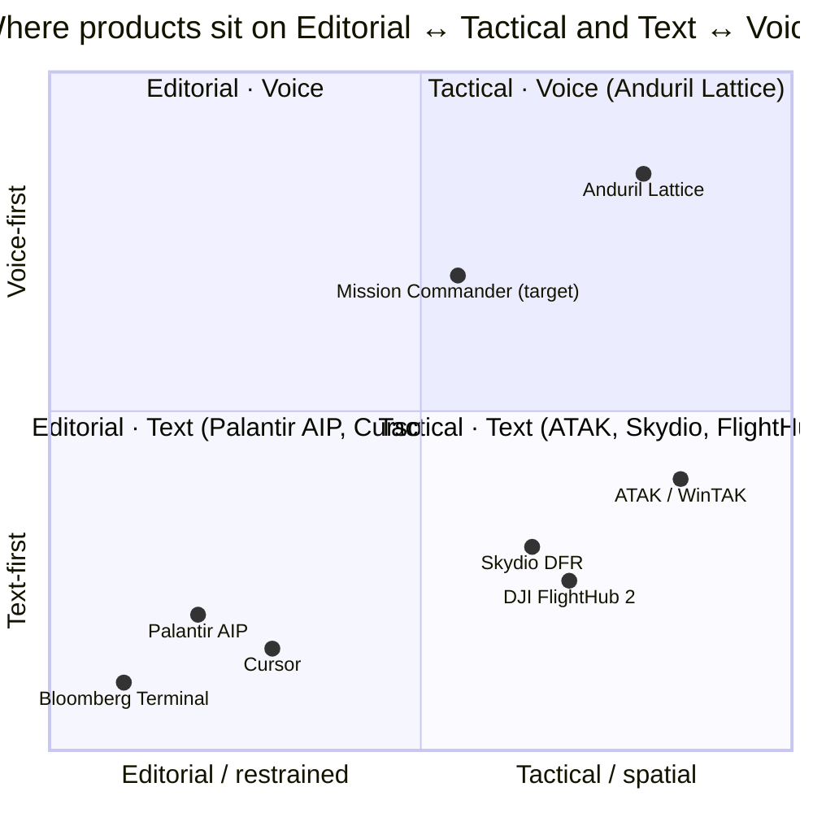
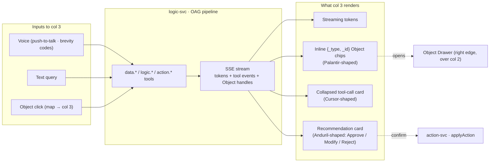

# ADR 0001 — UI Genre Reference & Layout Direction

| Field        | Value                                                                              |
| ------------ | ---------------------------------------------------------------------------------- |
| Status       | Accepted (research basis)                                                          |
| Date         | 2026-05-02                                                                         |
| Scope        | `platform-ui-app/` — operator UI surface                                           |
| Out of scope | `platform-control-plane/` (sibling ADR 0001 owns the data plane), simulation       |
| Companion    | `platform-control-plane/docs/0001-platform-architecture.md` (data plane spine)     |

---

## 1. Why this document exists

We are building the operator UI for an edge-native AI mission commander
("Cursor for command and control") on a 48-hour budget. The most
expensive failure mode is **inventing a UI vocabulary that operators,
judges, and the platform we're cloning (AIP/Foundry) don't already
share.** Genre fluency wins demos.

This ADR is the result of a deliberate research pass through the leading
products in the genre — Palantir Foundry/AIP, Anduril Lattice, Skydio
DFR Command, DJI FlightHub 2, Cursor, and secondary references (ATAK,
Bloomberg Terminal, HawkEye 360). It captures **what's conventional**,
**where the conventions diverge**, and **the specific blend we are
adopting** so that every UI decision downstream can ground in it
instead of relying on individual taste.

The 50/25/25 three-column layout is treated as an input here, not a
question. It was decided separately and is recorded in project memory.

---

## 2. The genre at a glance

Mission Commander aims for a deliberate blend: **Palantir's typographic
discipline and citation/Object-chip pattern in the AI copilot**,
**Anduril's notification-prompt + voice surface as the action
affordance**, and a **tactical dark map** sealed off inside an
otherwise editorial light shell.

---

## 3. Reference notes per product

### 3.1 Palantir (Foundry / AIP Threads / Workshop / Object Explorer / Quiver)

**Public visibility:** High for documentation, low for polished
marketing screenshots. Palantir's docs site shows real product
screenshots; the marketing pages are deliberately spartan.

**Layout:** Workshop is hierarchical — persistent module Header
(horizontal or vertical, collapsible) → Pages → Sections (Columns /
Rows / Tabs / Flow / Toolbar / Loop) → Widgets. Default new-page is a
two-column split; three-column compositions are built explicitly via a
Columns section. Overlays are **Drawers** (slide from left or right,
configurable width) and **Modals** (centered) — backdrop click closes
both. AIP Threads is two-pane: thread history on the left
(collapsible), conversation on the right with a Document card pinning
context at the top.

**Map:** Configurable, no strong house style. Palantir does not try to
own this surface the way Anduril does.

**Action surfaces — the load-bearing pattern.** AIP Chatbot output
renders with **inline citation bubbles** plus a **Sources dropdown at
the bottom of each message**. Selecting a citation:
- Ontology object → navigates to that object's **Object Explorer view**.
- Document → opens a dialog showing the referenced PDF page.
- URL → opens the link.

Citation click behavior is **overridable per object type** — admins can
rebind clicks to update app variables or open a panel. AI agent
proposals accumulate in a **Proposals tab**; accepting moves a
proposal card to an Applied column. Trello-like staged-approval, not
inline yes/no.

**Voice / comms:** **Absent.** AIP is text-first. This is a meaningful
absence — it leaves voice as a differentiator for us.

**Typography:** Blueprint design system, "optimized for complex
data-dense interfaces for desktop applications." Sans-proportional for
UI, mono used selectively. WCAG-compliant accessible color names. The
brand identity is "almost entirely typography, dark backgrounds, and
dense data visualization."

**Color discipline:** Workshop ships 5 preset shades each for light
and dark modes. **Blueprint Intents: Primary (blue), Success (green),
Warning (orange), Danger (red)** — the de facto semantic palette. Not
amber-y like Bloomberg — software-engineering blue.

**Density:** High. Tables, multi-column layouts, narrow padding,
Toolbar sections optimized for compact widgets.

**Most memorable visual signature:** **The Object Card / Object
reference as a typographic chip** with a colored leading icon and
click-through to a full Object View. The Ontology is the brand;
surfacing object types as first-class clickable references inside chat
and Workshop widgets is the pattern the rest of the industry is now
copying. **This is the exact pattern OAG instantiates in our
platform-control-plane ADR 0001.**

**URLs:**
- https://www.palantir.com/docs/foundry/threads/getting-started
- https://www.palantir.com/docs/foundry/workshop/concepts-layouts
- https://www.palantir.com/docs/foundry/object-explorer/overview
- https://www.palantir.com/docs/foundry/agent-studio/citations
- https://www.palantir.com/docs/foundry/quiver/overview
- https://www.palantir.com/docs/foundry/workshop/used-colors
- https://www.palantir.com/docs/foundry/assist/aip-assist-suggested-actions
- https://designsystems.surf/design-systems/palantir
- https://blog.palantir.com/inside-the-aipcon-8-demos-redefining-the-future-of-enterprise-ai-a0a740fe44ce

### 3.2 Anduril Lattice

**Public visibility:** Low. Anduril deliberately keeps detailed UI
screenshots out of marketing. The clearest public source is the **MIT
Technology Review hands-on demo (Dec 2024)** and the **Lattice OS
brochure PDF**.

**Layout:** Operator station described as "two large television
screens at the test site's command station" — multi-monitor is
assumed. Stated form factors: laptop, desktop, web UI, VR. One Medium
piece characterizes the Lattice UI as a "3D game-style interface" —
implying a richer, more immersive aesthetic than Palantir's flat
editorial style.

**Map:** Spine of the experience. "Creates a shared real-time
understanding... in a single pane of glass." Glyph language not
publicly documented in detail; sample apps render entities on a map
but Anduril doesn't publicly commit to MIL-STD-2525 symbology.

**Action surfaces — the most-quoted pattern in the genre.**
**Notification-prompt → one-click confirm.** From the MIT TR demo,
verbatim:

> "Lattice sent a notification asking the human operator if he would
> like to send a Ghost drone to monitor. After a click of his mouse,
> the drone piloted itself autonomously toward the truck."

> "Lattice asked the operator if he'd like to send a second attack
> drone... With one click, it could be instructed to fly into it fast
> enough to take it down."

Their own copy: Lattice "streamlines... by using deep learning models
to present operators with **recommended decision points**, not noise."
**The AI surfaces a recommended decision point as a discrete prompt;
the operator confirms with a single click; the system executes
autonomously.** This is the exact affordance for Mission Commander's
column-3 recommendation cards.

**Voice / comms:** **First-class.** From the Air & Space Forces piece
on the combat drone software:
- System uses **military "brevity codes"** with text-to-voice and
  voice-to-text.
- Verbatim exchange:
  - Operator: "Mustang, fence in"
  - System: "Authorization requested for approval"
  - Operator: "Authorized, commit all"

Note the structure: voice is **conversational and uses
domain-specific terminology**, not natural language. We should design
toward brevity-code-friendly transcripts, not "ask anything" chat.

**Typography:** Brand is uppercase tight-tracked sans. Product UI
presumed sans-only with mono for tabular telemetry, but no public
screenshot confirms this.

**Color discipline:** Brand is black + warm orange (≈#F46523) as the
single accent. Inside the product, semantic color follows tactical
convention — friendly cyan/blue, hostile red, neutral yellow,
unknown white — but no public commitment.

**Density:** Spatial, not tabular. Many tracks, layered overlays,
legibility via tight glyph design.

**Most memorable visual signature:** **Recommendation prompt →
one-click commit.** Operators describe being walked through kill
chains by a series of confirm dialogs.

**URLs:**
- https://www.anduril.com/lattice/command-and-control
- https://www.anduril.com/lattice/mission-autonomy
- https://www.anduril.com/lattice-sdk/
- https://developer.anduril.com/samples/overview
- https://www.technologyreview.com/2024/12/10/1108354/we-saw-a-demo-of-the-new-ai-system-powering-andurils-vision-for-war/
- https://www.airandspaceforces.com/sneak-peek-anduril-lifts-veil-combat-drone-software/
- https://sldinfo.com/wp-content/uploads/2022/10/2022-slick-Lattice-OS-AUS.pdf

### 3.3 Skydio DFR Command + DJI FlightHub 2

**Skydio DFR Command:**
- **Layout:** Left sidebar nav ("Dispatch" entry) + central Dispatch
  Map showing all active incidents, drone locations, and
  Axon-connected personnel (body cams). Right side is contextual.
- **Side-by-side:** map + drone live stream when piloting.
- **Roster:** Stoplight model — **Healthy / Limited Operation /
  Inoperable** per device (drones, Docks, External Radios, batteries,
  controllers). **Tri-state, not granular.**
- **AR overlay:** street names, house numbers, POIs in the live drone
  stream. Custom Markers can render as colored pillars in the live
  stream.
- **Heads-up display in Remote Flight Deck** brings contextual info
  into field of view.
- **Settings refactor note:** vehicle settings moved from top tabs to
  vertical-list-on-the-left because vertical scans better.

**DJI FlightHub 2:**
- **Real-time dashboard** — device status, task progress, flight stats.
- **Virtual Cockpit** — three-section live-flight interface.
- **2.5D Base Map** — satellite + elevation, with orthomosaics (RGB or
  infrared) auto-overlaid after each flight.
- **Multi-drone monitoring on a single screen** with flexible layout
  options.

**Cross-cutting drone-fleet patterns:**
- **Roster + map is canonical.** Skydio puts roster in left sidebar;
  DJI in dashboard top.
- **Status is 3-state stoplight**, not granular.
- **Drone live video is the second hero surface alongside the map** —
  never demoted to a thumbnail.

**URLs:**
- https://www.skydio.com/software
- https://www.skydio.com/software/dfr-command
- https://support.skydio.com/hc/en-us/articles/34696492823195-How-to-use-DFR-Command
- https://enterprise.dji.com/flighthub-2
- https://enterprise-insights.dji.com/blog/dji-flighthub-2-virtual-cockpit-now-available

### 3.4 Cursor (the IDE) — the explicit aesthetic anchor for col 3

**Layout:** Standard VS Code-derived 3-pane: file tree (left), editor
(center), AI panel (right). Width is user-resizable; default ~30% of
viewport. Cursor 2.0/3.0 introduced **Agent Tabs** — multiple agent
conversations side-by-side or in a grid. Compact mode hides tool
icons, collapses diffs by default, auto-hides input when idle.

**Chat / tool call rendering:**
- Tool calls render as **collapsible cards inline in the chat stream**.
  Each card has a header (tool name + summary like "Explored 12 files,
  4 searches") and an expand affordance.
- Cursor 1.0 explicitly called out **"collapsible sections in chat (so
  those multi-step agent logs don't overwhelm you)"** as a feature.
- "Scroll to bottom" appears when content overflows.
- Markdown tables and **Mermaid diagrams** render inline — chat is
  treated as a rich display surface, not just text.

**Apply / approval gates:**
- **Inline diff with selective apply.** Edits show a colored diff
  preview that you can **accept in full or per-hunk**.
- In Composer mode, **diffs for each file** with **navigate-through,
  each has accept/reject**.

**Typography:** Sans for chrome/labels; mono for everything in the
editor and any code snippet in chat.

**Color discipline:** Dark theme cultural default; ships light/dark.
Single accent is vivid blue/teal for active selection. Diffs use
universal red/green.

**Density:** Comfortable, not dense. Generous vertical breathing room
in chat (each message has padding); editor is dense, chat is editorial.

**Most memorable visual signature:** **The collapsed tool-call card**
with a one-line summary that opens to a full payload. The single most
reusable pattern for our AI copilot column.

**URLs:**
- https://cursor.com/changelog/3-0
- https://cursor.com/changelog
- https://cursor.com/features
- https://cursor.com/docs
- https://kingy.ai/blog/cursor-1-0-review-the-ai-first-code-editor-comes-of-age/
- https://uibakery.io/blog/cursor-chat-vs-composer

### 3.5 Secondary references

**ATAK / WinTAK:**
- **MIL-STD-2525B symbology** is the actual military glyph standard:
  friendly = blue rectangle/square, hostile = red diamond, unknown =
  yellow quatrefoil, neutral = green circle/square.
- **Cursor on Target (CoT)** data format: every track has position,
  timestamp, type, ID.
- WinTAK has a community Figma design system kit available — confirms
  the aesthetic is now legible enough that civilians can re-implement.
- Map-first; everything else is overlay or modal.

**Bloomberg Terminal:**
- **Black + amber** is the canonical pro-operator palette. Amber as
  base font color (vs neutral grey in modern systems) is "their
  strongest hallmark."
- Custom Matthew Carter-designed mono and proportional fonts —
  typography is brand.
- Used to be 4-panel max; new UI is fully tabbed and resizable. Dense
  pro tools converge on **tabbed-but-resizable, not fixed grids**.
- **CVD-aware color themes** — color as accessibility infra, not
  decoration.

**HawkEye 360 (RF):**
- Mostly delivered as an **ArcGIS Pro plugin** (RF Data Explorer).
  They don't own a UI surface; they ride on Esri.
- One UI element worth stealing: **the confidence ellipse** (a
  95%-probability ellipse around an RF emitter). Visual handling of
  "we don't know exactly where this is" — a pattern Mission Commander
  needs for low-confidence threat tracks.

**URLs:**
- https://en.wikipedia.org/wiki/Android_Team_Awareness_Kit
- https://tak.gov/products
- https://www.figma.com/community/file/1573375430276099247/wintak-design-system-windows-tactical-assault-kit-team-awareness-kit
- https://www.bloomberg.com/company/stories/how-bloomberg-terminal-ux-designers-conceal-complexity/
- https://www.bloomberg.com/ux/2021/10/14/designing-the-terminal-for-color-accessibility/
- https://mobbin.com/colors/brand/bloomberg
- https://www.esri.com/en-us/arcgis-marketplace/listing/products/646d8ad7fd4b4454a69e184aa8d6f7f7

---

## 4. Cross-cutting genre conventions

These show up across **every** product surveyed. Treat as defaults.

| #   | Convention                                                                                              |
| --- | ------------------------------------------------------------------------------------------------------- |
| C-1 | **The map is dark even when the rest of the shell isn't.** ATAK, Lattice, DFR Command, FlightHub all default-dark on the map specifically. |
| C-2 | **Status is stoplight-encoded, not granular.** Skydio (Healthy/Limited/Inoperable), Bloomberg (red/green), Lattice (binary recommended decision points), Palantir (4 Blueprint Intents). Pick 3, not 7. |
| C-3 | **AI proposes, human disposes.** Lattice's notification-then-click and Cursor's diff-then-accept are the same pattern under different skins. The AI surfaces a recommended decision point; the operator confirms with a single discrete action. **No autonomous-execute UI exists in any of these products.** |
| C-4 | **Citations / object references are first-class typographic chips inline in AI output.** Palantir Object chips, Cursor file/symbol mentions, ATAK CoT references — same shape: short label + leading icon + click-through to a richer view. **This is OAG visualized.** |
| C-5 | **Multi-pane / multi-monitor is assumed.** Lattice ships 4 form factors; Bloomberg lifted the 4-panel cap; FlightHub does multi-drone-on-one-screen; Cursor 3 has Agent Tab grids. Build for windowing. |
| C-6 | **Sans for UI, mono for tabular numerics and code.** Universal. Bloomberg goes further (custom fonts as brand); Cursor uses standard mono; Palantir sticks to Blueprint sans + selective mono. |
| C-7 | **Drawers and overlays beat full-page transitions.** Workshop has Drawers and Modals; Lattice has notification prompts; Cursor has diff overlays. Nothing in this genre takes you off the map / off the editor / off the COP to perform an action. |

---

## 5. Where Palantir and Anduril diverge — pick a side

| Dimension                  | Palantir (restrained / editorial)                                                                   | Anduril (slick / tactical)                                                                          |
| -------------------------- | --------------------------------------------------------------------------------------------------- | --------------------------------------------------------------------------------------------------- |
| **Aesthetic register**     | "Blackboard": flat, typographic, dense, nearly print-design. Black canvas, text is the hero.        | "Game HUD": map-spatial, mild 3D, bright accent (Anduril orange), cinematic.                        |
| **Action affordance**      | Citations + Proposals — accumulate in a list, review-and-apply later. **Trello-like staging.**      | Notification-then-confirm — single discrete prompt, one click, executes immediately. **Walk-and-commit.** |
| **AI surface**             | Threads / Chatbots / Assist — text-first, citation-heavy, asynchronous, document-anchored.          | Voice + brevity codes for combat-tempo operations. **Conversational, not text-y.**                  |
| **Brand inside the product** | Almost invisible. Black canvas, no logo presence in chrome. **The Ontology is the brand.**         | Visible. Dark canvas + warm orange brand accent that consistently appears on selection/focus.       |
| **Density**                | Tabular density. Small text, narrow padding, lots of rows.                                          | Spatial density. Many tracks, tight glyphs, generous chrome around them.                            |

**Mission Commander's blend (locked):**
- **Palantir's typographic discipline + Object-chip pattern in col 3** (the AI copilot)
- **Anduril's notification-prompt + voice surface as the action affordance**
- **Tactical dark map across all of them** (col 1)

The pitch is "Cursor for C2" — so col 3 should *read* as Cursor
(collapsible tool-calls, accept/reject diff cards), but the cards
themselves should be Anduril-shaped (single recommended decision,
one-click commit).

---

## 6. Recommendations for the 50/25/25 layout

```mermaid
flowchart LR
    subgraph C1["Col 1 · 50% · Observe (dark map, MIL-STD-2525)"]
        Map["Tactical map — dark substrate"]
        Layers["Layer pill chips (top edge)"]
        Glyphs["Friendly cyan · Hostile red diamond · Unknown yellow quatrefoil · Neutral green"]
        Conf["Confidence ellipses for low-confidence tracks"]
    end

    subgraph C2["Col 2 · 25% · Orient (vertical stacks, tabular density)"]
        Mission["MissionObjective banner"]
        Roster["Asset roster (Healthy / Limited / Inoperable)"]
        Threats["Threat list"]
        Feed["What changed feed"]
    end

    subgraph C3["Col 3 · 25% · Decide + Act (Cursor-shaped chat)"]
        PTT["Push-to-talk indicator (persistent, top)"]
        Stream["Streaming chat with Object chips"]
        ToolC["Collapsible tool-call cards"]
        Rec["Recommendation cards · Approve / Modify / Reject"]
    end

    Drawer["Object Drawer (right edge, slides over col 2)"]
    Bar["Bloomberg-style status bar (UTC · Zulu · Comms · Mission ID · Sensor count · Threat count)"]

    C1 -. select .-> Drawer
    C3 -. chip click .-> Drawer
    C1 ---|"events"| C2
    C2 ---|"context"| C3
    C3 ---|"applyAction"| C1
    Bar -.- C1
    Bar -.- C2
    Bar -.- C3
```

| #    | Recommendation                                                                                                                                                            |
| ---- | ------------------------------------------------------------------------------------------------------------------------------------------------------------------------- |
| R-1  | **Make the map dark, regardless of overall shell theme.** Most universal genre convention. If the shell is light, the map is a dark inset (already implemented via `.invert-surface`). |
| R-2  | **Use MIL-STD-2525-style glyph language on the map** — friendly cyan/blue, red diamond hostile, yellow quatrefoil unknown, green circle neutral. Don't invent. |
| R-3  | **Col 1 has minimal corner chrome** — only a layer-chip rail along the top edge. Map is the spine; give it everything. |
| R-4  | **Col 2 is a vertical stack** of stoplight-encoded asset rosters with tabular numeric secondaries. Skydio's tri-state. Tabular numerics in mono (latency, fuel, ammo). No cards-around-cards. |
| R-5  | **Col 3 structurally mimics Cursor** — collapsible tool-call cards, recommendation cards rendered like Cursor's diff-blocks (header + previewable consequence + Accept/Reject + partial-accept where meaningful), Object chips inline in AI text that open a Drawer (right edge, over col 2). |
| R-6  | **Voice is persistent, not a FAB.** Push-to-talk indicator pinned to the top of col 3. Brevity-code echoes render as inline message bubbles in the chat stream so voice + text share one transcript. |
| R-7  | **Status bar follows Bloomberg, not consumer SaaS.** Tabular: time (UTC + Zulu), comms link state, mission ID, sensor count, threat count — single dense row of mono. No logo, no avatar. Brand presence belongs on splash, not operator UI. |
| R-8  | **No FAB anywhere.** None of the reference products use them. Every action is inline in a card, in a side panel, or as a notification prompt overlay. *(Implication: kill the existing voice FAB; move it into col 3.)* |
| R-9  | **One overlay surface, many entry points** — a Drawer from the right edge over col 2 for any "show me details about X." Click a track on the map → drawer; click an Object chip in chat → same drawer. |
| R-10 | **One accent color, used ruthlessly.** Anduril's orange and Palantir's blue both work; using both is what doesn't. The accent encodes "AI-generated / focusable now." Semantic colors (red/amber/green) are reserved for threat-status, not UI affordance. *(We're committed to warm amber from the existing theme.)* |
| R-11 | **Typography stack: sans for UI, mono for all tabular numerics, NO serif on operational surfaces.** *(Open question for us: we've committed to Fraunces serif for editorial weight. Genre suggests dropping it. Decision deferred — see §8.)* |
| R-12 | **Density target: closer to Bloomberg than to Linear.** Tighter than reflex. Operators want information per square inch; whitespace looks "pretty" to designers and "underbuilt" to operators. |

---

## 7. Action-affordance lifecycle (the most-cited pattern)

Every reference product implements some shape of "AI proposes, human
disposes." Comparing the three relevant variants and our chosen blend:

```mermaid
flowchart TB
    subgraph PLT["Palantir AIP — staged proposals"]
        P1["AI emits proposal"] --> P2["Lands in Proposals tab"]
        P2 --> P3["Operator reviews list later"]
        P3 --> P4["Apply → Applied column"]
    end

    subgraph AND["Anduril Lattice — walk-and-commit"]
        A1["AI emits notification"] --> A2["Modal-ish prompt"]
        A2 --> A3["One click confirm"]
        A3 --> A4["Autonomous execution"]
    end

    subgraph CUR["Cursor — diff-and-apply"]
        C1["AI emits edit"] --> C2["Inline diff preview"]
        C2 --> C3["Per-hunk accept/reject"]
        C3 --> C4["Atomic apply"]
    end

    subgraph MC["Mission Commander — chosen blend"]
        M1["AI emits Recommendation Object<br/>(typed, with rationale + evidence)"]
        M1 --> M2["Card in col 3 stream<br/>· serif verb · evidence chips · confidence meter"]
        M2 --> M3{"Action gating tier"}
        M3 -->|"auto"| M4["Execute, log to audit-tail"]
        M3 -->|"confirm"| M5["Approve · Modify · Reject<br/>(one click, like Anduril)"]
        M3 -->|"forbid-llm"| M6["Hidden from LLM stream<br/>· operator-only path"]
        M5 --> M7["applyAction → audit_log"]
    end
```

The `auto | confirm | forbid-llm` tiers come from
`platform-control-plane/docs/0001-platform-architecture.md §7`.
**Confirm is the most common — and is what gives us the
walk-and-commit feel of Lattice.**

---

## 8. Open questions for the rebuild

| #   | Question                                                                                                                                              |
| --- | ----------------------------------------------------------------------------------------------------------------------------------------------------- |
| Q-1 | **Drop Fraunces serif on operational surfaces?** Genre says yes (sans-only with mono for tabular). We've already shipped serif for the brand mark and event verbs. Compromise: keep serif only on splash + event verbs in col 2's change feed; drop everywhere else. |
| Q-2 | **MIL-STD-2525 vs current glyph language.** Current map uses circle-with-heading-triangle for friendly drones, diamond for hostile. Genre prefers blue-rectangle (friendly) + red-diamond (hostile) + yellow-quatrefoil (unknown). Cost to switch: ~30 min in the map SVG. Likely worth doing. |
| Q-3 | **Confidence ellipse on low-confidence tracks.** HawkEye 360's pattern. Cost: small (one extra SVG group per track). Yes for the demo's "fusion" beat. |
| Q-4 | **Bloomberg-style top status bar.** Currently we have a header strip with mission name + clock + status pills. Bloomberg-style is denser: single mono row of (UTC · Zulu · Comms · Mission ID · Sensor count · Threat count) with no brand. Tradeoff: less "branded mission identity," more "operator station." Lean toward Bloomberg-style for the rebuild. |
| Q-5 | **Persistent push-to-talk indicator vs FAB.** Currently FAB. Recommendation R-6 says move into col 3 top. Cost: low; tied to the col-3 rebuild anyway. |
| Q-6 | **Object Drawer from right edge** as the single overlay. Currently we render selected-entity as a card *inside* the map. Genre prefers a slide-in drawer from the right that overlays col 2 (Palantir Workshop pattern). Cost: medium — needs new component, but `sheet.tsx` from shadcn is already in our toolbox. |
| Q-7 | **Multi-monitor / Agent-Tab equivalent?** Genre assumes multi-monitor. Out of scope for the 48-hour demo, but worth noting: nothing in our layout *prevents* a future "second screen" mode. |

---

## 9. Honest gaps in the research

- **No public Lattice screenshots exist at fidelity** that lets us
  describe its glyph language definitively. All claims about Anduril's
  exact symbology and color use are inferred from genre convention and
  brand identity — confirmed only at the level of "dark map,
  recommended-decision-points-as-prompts, voice-with-brevity-codes."
- **Palantir's exact AIP Threads chip rendering** is described in docs
  (citation bubbles + Sources dropdown) but no clean public screenshot
  was retrievable.
- **Cursor's pixel-level chat rendering** is undocumented publicly —
  descriptions are aggregated from changelogs, reviews, and forum
  threads.
- **DJI FlightHub 2 and Skydio DFR Command** are described from
  marketing/docs copy; no Dribbble-fidelity interface shots in public.

If higher-fidelity reference imagery is needed, the highest-leverage
next moves: (1) AIPCon 6 YouTube playlist (live demos of Threads with
object chips), (2) Anduril's own demo videos on YouTube, (3) install
Cursor and screenshot a real session for col-3 inspiration.

---

## 10. References (consolidated)

### Palantir
- https://www.palantir.com/docs/foundry/threads/getting-started
- https://www.palantir.com/docs/foundry/workshop/concepts-layouts
- https://www.palantir.com/docs/foundry/object-explorer/overview
- https://www.palantir.com/docs/foundry/agent-studio/citations
- https://www.palantir.com/docs/foundry/quiver/overview
- https://www.palantir.com/docs/foundry/workshop/used-colors
- https://www.palantir.com/docs/foundry/assist/aip-assist-suggested-actions
- https://designsystems.surf/design-systems/palantir
- https://blog.palantir.com/inside-the-aipcon-8-demos-redefining-the-future-of-enterprise-ai-a0a740fe44ce

### Anduril
- https://www.anduril.com/lattice/command-and-control
- https://www.anduril.com/lattice/mission-autonomy
- https://www.anduril.com/lattice-sdk/
- https://developer.anduril.com/samples/overview
- https://www.technologyreview.com/2024/12/10/1108354/we-saw-a-demo-of-the-new-ai-system-powering-andurils-vision-for-war/
- https://www.airandspaceforces.com/sneak-peek-anduril-lifts-veil-combat-drone-software/
- https://sldinfo.com/wp-content/uploads/2022/10/2022-slick-Lattice-OS-AUS.pdf

### Skydio / DJI
- https://www.skydio.com/software
- https://www.skydio.com/software/dfr-command
- https://support.skydio.com/hc/en-us/articles/34696492823195-How-to-use-DFR-Command
- https://enterprise.dji.com/flighthub-2
- https://enterprise-insights.dji.com/blog/dji-flighthub-2-virtual-cockpit-now-available

### Cursor
- https://cursor.com/changelog/3-0
- https://cursor.com/changelog
- https://cursor.com/features
- https://cursor.com/docs
- https://kingy.ai/blog/cursor-1-0-review-the-ai-first-code-editor-comes-of-age/
- https://uibakery.io/blog/cursor-chat-vs-composer

### Secondary
- https://en.wikipedia.org/wiki/Android_Team_Awareness_Kit
- https://tak.gov/products
- https://www.figma.com/community/file/1573375430276099247/wintak-design-system-windows-tactical-assault-kit-team-awareness-kit
- https://www.bloomberg.com/company/stories/how-bloomberg-terminal-ux-designers-conceal-complexity/
- https://www.bloomberg.com/ux/2021/10/14/designing-the-terminal-for-color-accessibility/
- https://mobbin.com/colors/brand/bloomberg
- https://www.esri.com/en-us/arcgis-marketplace/listing/products/646d8ad7fd4b4454a69e184aa8d6f7f7

---

## 11. Future UI ADRs

This document is the genre spine. Each item below will be elaborated
in its own ADR before or during the rebuild.

- **0002 — Layout & component composition.** The 50/25/25 grid spec,
  exact widths/breakpoints, what shadcn primitives map to which
  surface, the Object Drawer component, the col-3 streaming-message
  component.
- **0003 — Glyph language & map symbology.** MIL-STD-2525 alignment
  notes, our glyph SVG library, layer-chip taxonomy, confidence-ellipse
  spec.
- **0004 — Type & color system.** Final font decisions (resolves Q-1),
  the locked palette + `.invert-surface` token map, semantic-color
  rules.
- **0005 — Streaming chat UX.** SSE handling, Object-chip rendering,
  collapsible tool-call cards, recommendation card variants per gating
  tier (auto / confirm / forbid-llm), partial-accept patterns.
